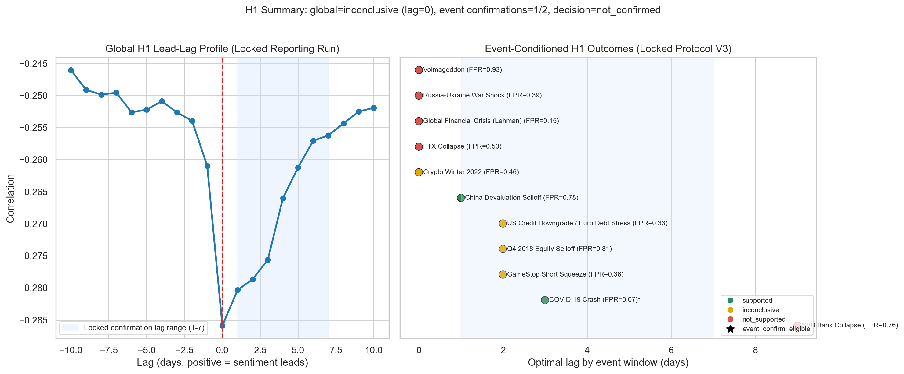
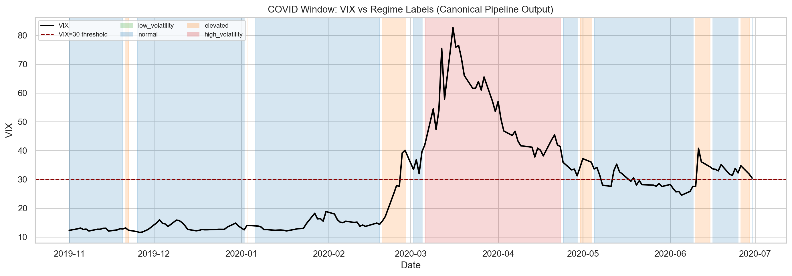

# Cross-Asset Sentiment Regime Detector: Automating Market Psychology Analysis Through Multi-Source NLP

Jonathan Rocha, Dr. David (King Ip) Lin
Master of Science in Data Science, Southern Methodist University, Dallas, TX 75275 USA
<jrocha@smu.edu>

## Abstract

Market regime shifts often precede measurable price movements through changes in collective market psychology, yet traditional risk indicators such as the VIX are inherently lagging and typically register stress after volatility has already emerged. This research develops an automated **Cross-Asset Sentiment Regime Detector** to determine whether market transitions can be identified before volatility spikes by applying an ensemble transformer sentiment model to financial news and social media across Equities, Crypto, Forex, and Commodities. The implemented **Two-Layer architecture** uses aligned sentiment-market inputs to estimate **GARCH(1,1)-based volatility features**, then applies a **Statistical Jump Model (JM)** with persistence controls to classify market regimes. Empirical results support H2 (divergence signal) and H3 (network effect), while H1 (leading indicator) does not achieve global confirmation under the fixed decision protocol.

## 1. Introduction

Financial markets move through behavioral regimes shaped by changing risk appetite, and those shifts are often reflected in text before they fully appear in price-based indicators. In practice, however, most operational risk frameworks still rely on lagging signals such as realized volatility and the VIX, which makes regime transitions easier to explain after the fact than to detect in time for risk control decisions. High-profile episodes such as the COVID-19 crash, the 2021 GameStop squeeze, and the 2022 crypto winter underscore the same pattern: narrative intensity and cross-market sentiment stress rise rapidly as market structure destabilizes.

Despite growth in financial NLP, most sentiment systems remain scoped to single assets, narrow source types, or dashboard-style interpretation workflows that do not directly produce reproducible regime labels. Traditional regime models also struggle with instability; Hidden Markov frameworks are often sensitive to local noise and can over-switch, degrading actionability. At the same time, mixed-frequency data alignment remains a core technical challenge because text events are irregular while market bars are regular, and cross-asset spillover dynamics are not well captured by siloed modeling designs.

This study addresses those constraints with a practical two-layer cross-asset architecture. The first layer engineers aligned volatility and sentiment features from market and text data, and the second layer applies a Statistical Jump Model to enforce persistence and reduce whipsaw transitions. The design is intended to move beyond single-market sentiment scoring toward a regime-oriented system that can be audited, rerun, and interpreted consistently across Equities, Crypto, Forex, and Commodities.

The research objective is to test whether cross-asset sentiment structure can provide lead or transition information that complements traditional volatility diagnostics. In this framework, H1 evaluates global lead-time behavior versus VIX-based stress; H2 evaluates divergence behavior near regime transitions; and H3 evaluates the connectedness structure across stable and transition regimes.

This study contributes a reproducible end-to-end framework with locked artifacts, walk-forward evaluation, and protocol-driven hypothesis testing. The evidence supports divergence and connectedness mechanisms (H2 and H3), while global lead-time confirmation versus VIX (H1) is not achieved under the locked criterion. Accordingly, the manuscript limits its claims to outcomes directly supported by the recorded evidence base.

## 2. Literature Review

### 2.1 Transformer Models in Financial Sentiment Analysis

#### 2.1.1 From Lexicons to BERT

The evolution of financial sentiment analysis mirrors the transition in natural language processing from symbolic, rule-based methods to neural network-based contextual language models. Initial approaches applied domain-adapted sentiment lexicons to extract polarity-bearing terms in financial corpora. Loughran and McDonald (2011) showed that generic sentiment dictionaries yield low precision for financial texts, as terms like “liability” possess distinct semantic valence in finance compared to general English. Their finance-oriented lexicon remediated this mismatch and established a benchmark resource for subsequent computational finance research.

The introduction of transformer-based architectures marked a paradigm shift in financial sentiment analysis. For instance, Araci (2019) introduced FinBERT, a BERT model fine-tuned on financial news and analyst reports, achieving a 15% accuracy improvement over previous state-of-the-art methods. Moreover, FinBERT demonstrated effectiveness even with limited labeled data, outperforming baseline models when trained on as few as 500 examples. As a result, this finding established the viability of transfer learning for financial NLP tasks with scarce labeled datasets.

Mishev et al. (2020) conducted over 100 experiments to systematically evaluate sentiment analysis approaches ranging from lexicons to transformers. Their comprehensive study compared BERT variants, including RoBERTa, XLNet, ALBERT, and DistilBERT, across multiple financial datasets. The results showed that contextual embeddings are substantially more efficient than lexicons and fixed-word encoders. BERT and ALBERT-xxlarge achieved the highest performance with Matthews Correlation Coefficient scores of 0.895 and 0.881, respectively. Notably, distilled versions of transformers, such as DistilBERT, retained more than 95% of BERT’s accuracy while requiring 40% fewer parameters, making them suitable for production environments with constrained computational resources.

#### 2.1.2 Large Language Models

The rise of large language models (LLMs) has enhanced financial sentiment analysis, especially via zero-shot and few-shot learning frameworks. Fatouros et al. (2023) assessed ChatGPT 3.5 for FX market sentiment evaluation, observing approximately 35% greater sentiment classification accuracy and 36% higher correlation with market returns than the domain-adapted FinBERT. Their zero-shot evaluation confirmed that LLMs can parse and classify financial texts without supervised domain adaptation, although prompt engineering was identified as a critical variable affecting output.

Konstantinidis et al. (2024) introduced FinLlama, a fine-tuned Llama 2 7B model optimized for financial sentiment analysis. They implemented Low-Rank Adaptation (LoRA) to reduce computational complexity, lowering the number of trainable parameters to 0.0638% of the total while maintaining model accuracy. In portfolio optimization tasks, FinLlama produced cumulative returns 44.7% higher than those of FinBERT-based portfolios, along with higher Sharpe ratios and lower annualized volatility. Beyond binary sentiment detection, FinLlama provides sentiment polarity scores, enabling traders to extract nuanced insights from financial news articles.

Luo and Gong (2024) demonstrated that supervised fine-tuning of LLaMA-2 7B achieves state-of-the-art performance on the Financial PhraseBank benchmark, improving accuracy from 0.86 to 0.90. Their experiments compared few-shot learning, further pre-training, and supervised fine-tuning, finding that further pre-training alone does not yield noticeable improvement over baseline performance. The supervised fine-tuning approach proved most effective, confirming that task-specific adaptation remains essential even for large pre-trained models.

Shen and Zhang (2024) compared FinBERT against GPT-3.5-turbo and GPT-4o for sentiment analysis on financial news articles and reports. Their findings indicated that FinBERT with domain-specific pre-training consistently outperformed general-purpose LLMs in accuracy, precision, recall, and F1-score. However, GPT-4o, given few-shot examples of financial texts, achieved competitive results, suggesting that effective prompt engineering can make general-purpose LLMs viable tools for financial sentiment analysis without extensive fine-tuning.

#### 2.1.3 Model Comparison and Selection Criteria

Systematic comparisons across model architectures have clarified the trade-offs between accuracy, computational cost, and deployment considerations. Nasiopoulos et al. (2025) conducted a comparative study of fine-tuned deep learning models, including GPT-4o, GPT-4o-mini, BERT, and FinBERT, benchmarked against traditional machine learning classifiers. Using Bayesian optimization across 100 trials for hyperparameter tuning, they found that fine-tuned GPT-4o and GPT-4o-mini achieved 87.79% accuracy on the combined FiQA and Financial PhraseBank datasets. Traditional approaches, including Support Vector Machines, Random Forests, and Logistic Regression, lagged substantially behind, with accuracies of 64.53% to 65.31%. Fine-tuned LLMs outperformed fine-tuned BERT models by approximately 9% in mean accuracy, though at the cost of increased computational time and inference expense.

Mahendran et al. (2025) reviewed advances in financial sentiment analysis using BERT, FinBERT, and large language models, highlighting practical considerations for deployment. Their analysis noted that DistilBERT retains 97% of BERT’s capabilities while requiring only half the parameters, making it suitable for low-latency applications such as algorithmic trading and real-time market monitoring. The review identified persistent challenges, including model bias, limited interpretability, high computational requirements, and ethical concerns around data privacy and market manipulation. Domain-specific adaptation remains essential because financial language contains jargon and subtle expressions that general-purpose models may misinterpret.

Liu et al. (2024) provided a comprehensive review of large language models and sentiment analysis in financial markets, synthesizing advances across datasets, methodologies, and application domains. Their analysis cataloged publicly available financial sentiment datasets and evaluated both traditional machine learning approaches and modern transformer-based methods. The review emphasized that while LLMs demonstrate impressive zero-shot capabilities, their practical deployment in financial contexts requires careful consideration of inference latency, computational costs, and the need for domain-specific calibration. Their case study on market prediction illustrated how sentiment features derived from news and social media can be integrated with technical indicators to improve forecasting accuracy.

Ergun and Sefer (2025) proposed FinSentiment, a comprehensive transfer-learning framework that produces finance-specific versions of multiple pretrained models, including Fin-BERT, Fin-XLNet, Fin-RoBERTa, Fin-GPT, Fin-Llama, and Fin-T5. Their experiments across three financial sentiment datasets demonstrated that models pretrained on financial corpora consistently outperform their general-domain counterparts. RoBERTa pretrained on financial text exhibited exceptional performance and robustness, achieving state-of-the-art results even when fine-tuned on as few as 250 labeled samples. This finding suggests that transfer learning techniques offer effective solutions for financial sentiment analysis, particularly in data-scarce settings.

#### 2.1.4 Domain-Specific Fine-Tuning Approaches

Beyond architecture selection, recent research has investigated how the composition of the pre-training corpus and feature engineering influence model performance. Delgadillo et al. (2024) developed FinSoSent, a domain-specific language model pretrained on 49 million words from the Thomas Reuters Corpus of financial news articles. Through over 860 experiments with varying learning rates, epochs, and batch sizes, they found that selecting the right hyperparameter configuration is as critical as domain-specific pre-training for achieving optimal performance. While FinSoSent outperformed baseline models, including Amazon Comprehend, GPT-3.5-Turbo, IBM Watson, SentiStrength, and VADER, the performance differences were marginal, with accuracy in the 50-60% range across the datasets tested. Ensemble methods using majority voting provided modest additional improvements, underscoring the difficulty of sentiment analysis even with domain-specific approaches.

Cicekyurt and Bakal (2025) explored BERT-based knowledge transfer to enhance sentiment analysis of stock market tweets. Their approach leveraged pre-trained BERT representations and applied targeted fine-tuning on Twitter-specific financial discourse, addressing the unique linguistic characteristics of social media text, including abbreviations, hashtags, and informal language. The study demonstrated that knowledge transfer from general-domain BERT to finance-specific Twitter data yields significant performance improvements over training from scratch, particularly when labeled data is limited. Their findings reinforce the value of transfer learning strategies for sentiment analysis of noisy, informal financial text.

Sun et al. (2025) addressed persistent challenges in neutral sentiment recognition with EnhancedFinSentiBERT, a three-branch architecture integrating financial-domain pre-training, dictionary knowledge embedding, and neutral feature extraction. The dictionary knowledge component employs dynamic weight adjustment based on word performance across financial contexts and implements a multi-dimensional sentiment representation that captures not only polarity but also intensity and market impact. The neutral feature extractor uses multi-head attention mechanisms to capture subtle distinctions between neutral and sentiment-bearing expressions. In experiments comparing against BERT-base, XLNet, GPT-4, Llama 2, FinBERT, and BloombergGPT, EnhancedFinSentiBERT achieved F1 scores of 87.0% on Financial PhraseBank, 88.0% on FiQA, and 97.6% on Headline datasets. On consensus-labeled subsets, F1 scores reached 98.0%, indicating that the model performs exceptionally well when annotator agreement is high. Ablation analysis revealed that dictionary knowledge embedding and neutral feature extraction contribute most significantly to performance improvement, suggesting that architectural innovations beyond model scaling remain valuable for financial sentiment analysis.

Recent synthesis work reinforces these model-level findings while emphasizing evaluation rigor. Todd et al. (2024) and Ehsan et al. (2025) identify recurring weaknesses in financial sentiment studies, including inconsistent benchmark design, limited cross-dataset comparability, and under-reporting of deployment tradeoffs. Complementary evidence from crypto-focused modeling by Moradi-Kamali et al. (2025) and exchange-rate forecasting by Gu and Song (2026) suggests that contextualized finance-specific language modeling continues to improve directional signal quality, but gains are sensitive to task framing and temporal validation design.

### 2.2 Financial Sentiment and Market Prediction

Market sentiment has long been recognized as a fundamental driver of asset prices, extending far beyond rational expectations models of price formation. This section examines the theoretical foundations of investor sentiment, empirical evidence linking sentiment to market returns, and recent advances in computational sentiment analysis that enable real-time prediction across traditional and digital asset classes.

#### 2.2.1 Foundational Work on Investor Sentiment

The theoretical foundations of behavioral finance trace to Keynes’ (1936/1973) concept of “animal spirits”—the spontaneous urge to action rather than inaction that drives economic decisions beyond cold calculation. This insight anticipated decades of research demonstrating that markets are not merely information-processing mechanisms but also arenas of collective psychology.

Baker and Wurgler (2007) operationalized investor sentiment measurement through a composite index derived from six market-based proxies: the closed-end fund discount, NYSE share turnover, the number of IPOs, the average first-day IPO return, equity share in new issues, and the dividend premium. Their seminal finding revealed that sentiment predicts cross-sectional stock returns, with the effect concentrated in difficult-to-arbitrage, hard-to-value stocks—small, young, high-volatility, unprofitable, non-dividend-paying, extreme-growth, and distressed. The sentiment index exhibits a correlation of 0.43 with contemporaneous market returns and demonstrates significant predictive power for future returns, particularly during sentiment extremes. Baker and Wurgler’s framework established that sentiment is not merely noise but a systematic factor that professional investors cannot fully arbitrage away because of limits on short selling and the costs of trading in affected securities.

#### 2.2.2 Social Media as Predictive Signal

The emergence of social media platforms created unprecedented opportunities for real-time, scale sentiment measurement. Bollen et al. (2011) conducted a foundational study using approximately 9.8 million tweets collected over ten months in 2008. Their methodology employed two sentiment tools: OpinionFinder for binary positive/negative classification and Google Profile of Mood States (GPOMS) for six-dimensional mood measurement (Calm, Alert, Sure, Vital, Kind, Happy). The critical finding was that the “Calm” dimension demonstrated Granger causality with DJIA movements at lags of 2-6 days. A Self-Organizing Fuzzy Neural Network (SOFNN) trained on historical DJIA and the Calm mood dimension achieved 86.7% directional accuracy in predicting DJIA closing values, a significant improvement over baseline models using only historical price data. This study established the principle that aggregate social media mood contains forward-looking information about market movements.

Renault (2017) extended social media sentiment research to intraday timeframes using StockTwits, a platform specifically designed for financial discussion. Analyzing S&P 500 stock discussions, the study found that first-half-hour sentiment predicts last-half-hour returns on the same trading day, with accuracy ranging from 74% to 76%. Notably, novice-labeled traders drove this effect more strongly than expert-labeled traders, suggesting that StockTwits sentiment captures retail investor psychology rather than institutional views. This finding is particularly relevant for regime detection, as retail sentiment extremes often precede market turning points when institutional investors have not yet repositioned.

#### 2.2.3 Cryptocurrency-Specific Sentiment Analysis

Cryptocurrency markets, characterized by 24/7 trading, high retail participation, and strong social media presence, provide a natural laboratory for sentiment-based prediction research. The asset class’s sensitivity to narrative and community dynamics makes it particularly amenable to sentiment analysis approaches.

Kraaijeveld and De Smedt (2020) examined the predictive power of Twitter sentiment for nine major cryptocurrencies: Bitcoin, Bitcoin Cash, EOS, Ethereum, IOTA, Litecoin, NEO, Ripple, and Tron. Using a labeled dataset and machine learning classifiers, they found significant predictive relationships for Bitcoin, Bitcoin Cash, and Litecoin with lead times of 1-4 days. The study also documented that 1-14% of tweets in their corpus originated from bot accounts, highlighting data quality challenges specific to crypto sentiment analysis. Their Granger causality tests showed that social media sentiment contains information not fully reflected in prices, supporting its use as a leading indicator.

Roumeliotis et al. (2024) conducted a comprehensive comparison of language models for cryptocurrency sentiment analysis, providing crucial benchmarking data for model selection. Their evaluation found:
Fine-tuned GPT-4 achieved 86.7% accuracy, followed by FinBERT at 84.3%, BERT at 83.3%, and zero-shot GPT-4 at 82.9%.

These results demonstrate that domain-specific fine-tuning (FinBERT) achieves near-parity with state-of-the-art LLMs at substantially lower computational cost. The marginal improvement from GPT-4 fine-tuning (2.4 percentage points over FinBERT) must be weighed against significant increases in inference cost and latency, which are practical considerations for real-time regime detection systems.

Raheman et al. (2022) evaluated 21 machine learning models for social media sentiment-based cryptocurrency prediction, finding that the best-performing model achieved a correlation of 0.57 between predicted and actual returns after fine-tuning. Their analysis revealed that interpretable models (gradient boosting, random forests) often outperformed black-box deep learning approaches, with peak predictive power at a -2 day lag. This finding supports the use of ensemble methods combining interpretable and neural components for robust sentiment-based prediction.

Trushkovskyi (2025) quantified the economic significance of social media sentiment for cryptocurrency returns, finding that a one-unit increase in sentiment score corresponds to 0.24-0.25% higher next-day returns. XGBoost models outperformed linear specifications, and Granger causality tests confirmed bidirectional relationships between sentiment and returns. The study’s emphasis on practical trading applications—demonstrating that sentiment signals survive transaction costs—provides validation for sentiment-based regime detection approaches.

#### 2.2.4 Lead Time Evidence Synthesis

Across asset classes and methodologies, the literature consistently demonstrates that sentiment signals precede market movements. Table 2.2.1 synthesizes predictive lead times from major studies:

Table 2.2.1: Lead Time Evidence Synthesis

| Study | Asset Class | Lead Time | Accuracy/Correlation |
| --- | --- | --- | --- |
| Bollen et al. (2011) | Equities (DJIA) | 2-6 days | 86.7% accuracy |
| Renault (2017) | Equities (S&P 500) | Intraday (hours) | 74-76% |
| Kraaijeveld and De Smedt (2020) | Cryptocurrency | 1-4 days | Significant Granger causality |
| Raheman et al. (2022) | Cryptocurrency | -2 days peak | 0.57 correlation |
| Trushkovskyi (2025) | Cryptocurrency | 1 day | 0.24-0.25% per unit |
| Baker and Wurgler (2007) | Equities (broad) | Monthly | 0.43 correlation |

This convergence across independent studies using different methodologies, time periods, and asset classes strengthens the theoretical foundation for sentiment-based regime detection. The consistency of 1-6 day lead times suggests an optimal window for regime-transition early-warning systems.

The data layer supporting these analyses has expanded in parallel. Fottner et al. (2022) introduced a Reddit financial image-post sentiment dataset, while Dong et al. (2024) and Xu et al. (2025) proposed multimodal financial time-series datasets that combine textual and market signals. These resources highlight a broader methodological shift toward reproducible, multi-source benchmarks for sentiment-linked forecasting and regime analysis.

#### 2.2.5 Limitations and Short-Term Prediction Challenges

Despite the encouraging evidence for sentiment-based prediction, recent research has identified important limitations that temper expectations for real-time applications. Kengmegni (2024) conducted a rigorous analysis of news sentiment for next-day stock prediction, finding that agreement ratios between sentiment signals and subsequent price movements hover around 0.5—essentially random chance. The study documented that market efficiency has increased over time, with prediction error standard deviations declining from 0.2 in 2009 to 0.065 by 2023, suggesting that markets have become more efficient at incorporating sentiment information.

Critically, Kengmegni found that economy-wide sentiment measures outperform stock-specific sentiment for predictive purposes, suggesting that aggregate sentiment indices may capture systematic factors that individual stock sentiment cannot. This finding supports our research design’s focus on cross-asset aggregate sentiment rather than single-security approaches. The study’s conclusion that “next-day stock prediction remains elusive” underscores the importance of regime-level analysis (identifying broad market states) rather than precise return prediction.

#### 2.2.6 Cross-Asset Sentiment Spillover

While single-asset sentiment analysis is mature, cross-asset approaches remain sparse but show significant promise. Caferra (2022) examined sentiment spillovers between cryptocurrency (Bitcoin) and stock markets (S&P 500) using Transfer Entropy methods. The study found that sentiment metrics mediate the relationship between these markets: crypto sentiment affects stock returns, and economic sentiment influences Bitcoin dynamics. Notably, entropy-based methods outperformed traditional VAR models in identifying these connections, demonstrating the value of information-theoretic approaches for cross-asset analysis.

Cao et al. (2025) investigated sentiment-connectedness networks among S&P 500 firms using nonlinear Granger causality methods and entropy-based centrality measures. Their findings revealed that firms with higher sentiment connectedness face significantly elevated stock price crash risk. The effect was particularly pronounced during market extremes, when sentiment connectedness proved a better predictor than individual firm sentiment. This work demonstrates how network-based sentiment analysis can identify the propagation of systemic risk.

Nyakurukwa and Seetharam (2025) mapped investor sentiment networks across DJIA stocks, finding that sentiment is highly interconnected among major equities and influences market behavior through network propagation effects. Their network analysis approach provides methodological foundations for understanding how sentiment flows through interconnected markets. These foundations for cross-asset sentiment transmission are explored further in Section 2.3.

### 2.3 Cross-Asset Sentiment Analysis

While sentiment analysis has matured for individual asset classes, integrating sentiment signals across multiple markets remains a frontier with significant theoretical and practical implications. Cross-asset sentiment analysis examines how investor psychology propagates across market boundaries, revealing interconnections that traditional correlation measures may miss. This section surveys the emerging literature on sentiment spillovers, cross-market transmission mechanisms, and the extension of sentiment analysis to forex, commodities, and multi-asset portfolio contexts.

#### 2.3.1 Sentiment Spillover Mechanisms

The theoretical foundation for cross-asset sentiment analysis rests on the observation that investor psychology does not respect asset class boundaries. Caferra (2022) provided seminal evidence of sentiment spillovers between cryptocurrency (Bitcoin) and equity markets (S&P 500) using Transfer Entropy methods—an information-theoretic approach that captures directional information flow beyond linear correlations. The study found that crypto sentiment affects stock returns, while economic sentiment influences Bitcoin dynamics, demonstrating bidirectional sentiment transmission. Importantly, entropy-based methods outperformed traditional VAR models in identifying these connections, suggesting that sentiment spillovers are fundamentally nonlinear and require appropriate analytical tools.

Wang et al. (2024) extended cross-asset analysis to China’s stock and bond markets, discovering asymmetric momentum transmission: stock market momentum negatively influences bond returns, while bond market momentum positively influences stock returns. Their analysis revealed that hybrid funds serve as intermediaries in this transmission mechanism, with more flexible asset allocation enabling stronger cross-market effects. For every 1% increase in hybrid fund returns, the CSI 300 Index increased by 0.73-0.86%. These findings demonstrate that institutional investment vehicles can amplify or dampen cross-asset sentiment propagation, a consideration relevant for understanding how sentiment signals may be transmitted—or distorted—across market boundaries.

#### 2.3.2 Network-Based Approaches and Sentiment Connectedness

Network analysis has emerged as a powerful framework for understanding sentiment dynamics across interconnected markets. Cao et al. (2025) investigated sentiment-connectedness networks among S&P 500 firms using nonlinear Granger causality and entropy-based centrality measures, finding that firms with higher sentiment connectedness face significantly elevated stock price crash risk. The effect was particularly pronounced during market extremes, when network-level sentiment measures outperformed individual-firm sentiment for risk prediction.

Yang et al. (2025) introduced a Cross-Asset Risk Management framework that leverages large language models for real-time monitoring of equity, fixed-income, and currency markets. Their approach synthesizes market signals across asset classes to identify potential risks and opportunities, achieving 82.1% accuracy in predicting market shifts—substantially outperforming traditional methods, including blockchain-enhanced frameworks (74.0%) and conventional big data approaches (75.2%). The framework’s integration of GPT-4 and Llama-3-30b for interpreting financial texts across asset classes demonstrates the practical feasibility of unified, cross-asset sentiment-monitoring systems.

#### 2.3.3 Forex and Currency Market Sentiment

Foreign exchange markets, characterized by 24-hour trading and sensitivity to macroeconomic narratives, present unique opportunities for sentiment-based analysis. Olaiyapo (2024) examined sentiment analysis for generating Forex trading signals, combining lexicon-based analysis with Naive Bayes classification on news articles and social media posts related to the US Dollar. The Naive Bayes model achieved 85% classification accuracy with a precision of 0.87 and an F1-score of 0.86. When combined with technical indicators (moving averages and RSI), the sentiment-based signals generated over 12% profit during the testing period, demonstrating the practical value of sentiment integration for currency trading.

Dakalbab et al. (2025) advanced forex prediction by integrating technical and sentiment analysis via cross-modal attention mechanisms within a multimodal deep learning framework. Testing on EUR/USD, GBP/USD, and USD/JPY currency pairs, their hybrid attention model achieved an accuracy of 82.9% and a Matthews Correlation Coefficient of 0.744-0.776, consistently outperforming single-modality approaches. The study’s key contribution was to demonstrate that sentiment-technical fusion captures market dynamics that neither modality alone can capture—a finding with direct implications for multi-source regime-detection systems.

Sibande et al. (2021) established a direct link between herding behavior in currency markets and investor sentiment using a Twitter-based happiness index. Analyzing nine developed-market currencies, they found that forex markets exhibit strong anti-herding behavior, particularly during extreme sentiment states. The relationship between sentiment and anti-herding proved regime-specific: extreme bullish or bearish sentiment strengthened anti-herding, while average sentiment was associated with weaker effects. These findings suggest that real-time sentiment monitoring can identify periods of heightened speculative activity in currency markets—a capability directly relevant to regime detection.

#### 2.3.4 Multi-Asset Portfolio Integration

The integration of sentiment analysis into multi-asset portfolio management represents a natural extension of cross-asset research with significant practical applications. Sarfarazurrehman et al. (2025) explored AI and machine learning models for cross-asset investment risk analysis spanning real estate and equities markets. Their Deep Reinforcement Learning (DRL) and LSTM-based approaches achieved cumulative returns of 29.52% with a Sharpe ratio of 0.98, significantly outperforming traditional Mean-Variance Optimization. The study also documented that real estate investment trusts (REITs) are pervasive transmitters of long-term volatility, with shocks lasting longer than those in equities, commodities, and bonds—underscoring the importance of understanding cross-asset risk propagation.

Pankwaen et al. (2025) developed an Iterative Model Combining Algorithm (IMCA) for global cross-market trading optimization across 39 stocks from multiple regions, as well as Bitcoin. Their framework dynamically recalibrates model weights in response to real-time market conditions, achieving cumulative returns of 29.52% and a Sharpe ratio of 0.829. Critically, the study evaluated performance during major market disruptions, including COVID-19, the SVB crisis, and the 2022 crypto crash, demonstrating that adaptive multi-asset frameworks maintain effectiveness across regime transitions. The IMCA framework’s success in volatile conditions suggests that dynamic, sentiment-aware approaches may be essential for robust cross-asset regime detection.

#### 2.3.5 Commodities and Safe-Haven Asset Sentiment

Commodities, particularly gold as a traditional safe-haven asset, exhibit unique sentiment dynamics that complement equity and currency analysis. Shi (2025) developed a sentiment-based GARCH-MIDAS hybrid model to explain the unusual 2020-2022 period, when gold prices rose 40% despite a 12% increase in the US Dollar Index, violating their typical inverse relationship. Using FinBERT-scored sentiment from financial media, the augmented model reduced out-of-sample prediction errors by 18.7% compared with traditional volatility models (23.6% reduction in MSE relative to standard GARCH).

The study identified sentiment-driven herding effects, amplified by pandemic uncertainties and geopolitical tensions, as critical drivers of the shift in the gold-DXY correlation. Notably, negative sentiment had 1.8 times the marginal impact on volatility of positive sentiment—an asymmetric effect consistent with loss-aversion theory in behavioral finance (see also the negativity bias findings in Nyakurukwa and Seetharam 2025, discussed in Section 2.2.5). Sentiment factors accounted for approximately 15% of previously unobserved heteroskedasticity in long-term volatility components, establishing a new paradigm for incorporating behavioral factors into commodity pricing models.

The cross-asset evidence reviewed in this section—spanning crypto-equity spillovers, currency market herding, multi-asset portfolio optimization, and commodity safe-haven dynamics—demonstrates both the feasibility and value of unified sentiment analysis frameworks. These findings motivate our research design, which synthesizes sentiment signals across all four asset classes to detect regimes rather than to predict single assets.

### 2.4 Market Regime Detection

Having established in Sections 2.1-2.3 that transformer-based sentiment analysis achieves strong classification performance, and that sentiment signals demonstrate predictive power across individual and cross-asset contexts, we now turn to the challenge of integrating these insights for market regime detection. Identifying market regimes—distinct periods characterized by different return distributions, volatility patterns, and investor behavior—is a critical challenge in financial modeling. Accurate regime detection enables portfolio managers to dynamically adjust allocations, hedge against downside risk, and capitalize on regime-specific opportunities. This section reviews traditional approaches, machine learning innovations, and the emerging role of sentiment signals in regime identification.

#### 2.4.1 Traditional Approaches

Classical regime detection relies on threshold-based indicators and statistical models that identify regimes from observable market data:
Common examples include volatility thresholds (for example, VIX levels above 30 for Risk-Off and below 15 for complacent Risk-On), moving-average crossover signals such as the Death Cross, macroeconomic markers such as yield-curve inversion and weakening PMI, and Hidden Markov Models that infer latent state transitions from observed market series.

The fundamental limitation of these approaches is their lag—they identify regimes after transitions have already progressed substantially. Baker and Wurgler (2007) demonstrated that investor sentiment indices predict broad market returns, suggesting that behavioral signals may provide earlier regime indicators than price-based methods. However, their sentiment proxies relied on indirect measures (closed-end fund discounts, IPO volume, equity issuance share) rather than direct textual sentiment extraction.

#### 2.4.2 Machine Learning Methods

Modern machine learning approaches have substantially advanced regime detection by learning complex patterns from multiple signal sources.

##### 2.4.2.1 Statistical Jump Models vs. Hidden Markov Models

While Hidden Markov Models (HMMs) have traditionally served as the standard for regime detection, recent scholarship highlights significant limitations in their ability to handle signal instability. Shu et al. (2024) demonstrate that HMMs are highly sensitive to daily market noise, often identifying "short-lived regimes that are unintuitive and difficult to trade". This sensitivity results in "whipsaw" signals—frequent, spurious state flips that degrade performance through excessive transaction costs.

To address the lack of persistence in HMMs, **Statistical Jump Models (JMs)** offer a superior alternative by incorporating a discrete "jump penalty" ($\lambda$) directly into the objective function. Unlike HMMs, which rely solely on transition probabilities, this penalty mathematically enforces regime persistence, requiring substantial evidence of a structural shift before triggering a state change. Empirically, JMs have been shown to reduce annualized portfolio turnover by approximately two-thirds compared to HMMs (44% vs. 141% for the S&P 500) while simultaneously improving risk-adjusted returns and reducing maximum drawdown. Consequently, JMs provide a more robust framework for risk management applications where regime stability is paramount.

##### 2.4.2.2 Explainable and Ensemble Approaches

Zhang et al. (2020) developed an explainable machine learning framework for regime-based asset allocation using hierarchical clustering. Their model integrated macroeconomic indicators with market technical signals to divide economic conditions into four distinct regimes, then applied the Black-Litterman model for portfolio optimization. Backtesting from August 2010 to May 2020 achieved 22.53% annualized returns with a Sharpe ratio of 1.06, significantly outperforming both equal-weighted benchmarks and traditional Black-Litterman implementations. Critically, their approach captured both major market upswings and successfully withdrew capital before market crashes, demonstrating the practical value of regime-aware allocation strategies.

Shu et al. (2024) proposed a statistical jump model (JM) approach that enhances traditional Markov-switching models by imposing jump penalties at each state transition. This penalty mechanism promotes regime persistence, reducing spurious switching signals that plague traditional HMMs. Evaluating the approach across U.S., German, and Japanese equity indices from 1990 to 2023, they found that the JM-guided strategy consistently reduced volatility and maximum drawdown while improving Sharpe ratios relative to both the buy-and-hold and HMM-guided strategies. The JM approach increased compound annual growth rates by 1-4% across regions while limiting turnover to approximately 44%.

Suárez-Cetrulo et al. (2023) conducted a systematic review of 140 studies on machine learning for financial prediction under regime change. Their analysis identified four primary algorithmic categories showing promise: evolving systems (32.1% of studies), ensemble-based methods, traditional systems adapted to concept change, and neural networks with online learning capabilities. A critical finding was that most conventional machine learning techniques struggle with abrupt structural changes—the exact characteristic that distinguishes regime transitions from normal market fluctuations. They emphasized that the literature on online learning (concept drift) and regime switching has developed largely independently, even though it addresses fundamentally similar challenges.

Table 2.4.1: Regime Detection Performance Comparison

| Approach | Method | Annual Return | Sharpe Ratio | Key Advantage | Citation |
| --- | --- | --- | --- | --- | --- |
| Hierarchical Clustering | Black-Litterman integration | 22.53% | 1.06 | Explainability | Zhang et al. (2020) |
| Statistical Jump Model | Jump-penalty regime switching | +1-4% vs. benchmark | Higher vs. HMM | Reduced turnover | Shu et al. (2024) |
| Relative Sentiment | Sentix + ML ensemble | +400-700 bps | Improved | Cross-regional validity | Micaletti (2022) |
| Mixed-Frequency | MF-EEMD-ML | - | - | 19.18% MAE reduction | Cai et al. (2024) |
| Intraday Sentiment | Field-specific lexicon | 4.55% (strategy) | 1.496 | Leading indicator | Renault (2017) |

#### 2.4.3 Sentiment-Based Regime Detection

The application of sentiment analysis to regime detection remains an emerging frontier with substantial untapped potential. Foundational work has established that sentiment signals possess predictive power for market movements:

Bollen et al. (2011) demonstrated that Twitter mood states predicted DJIA movements 2-6 days ahead with 86.7% accuracy (87.6% direction accuracy in validation), establishing sentiment as a potentially leading indicator for market direction. Their analysis identified specific emotional dimensions (calm and anxiety) that correlated with subsequent market movements, suggesting that shifts in investor psychology precede price adjustments.

Renault (2017) constructed a field-specific sentiment lexicon from StockTwits messages and examined intraday relationships between sentiment and returns of the S&P 500 ETF. The study found that first-half-hour sentiment changes predicted last-half-hour returns, with the sentiment effect primarily driven by novice traders. A trading strategy exploiting this pattern achieved a Sharpe ratio of 1.496, with significant price reversals the following trading day—consistent with noise-trading theory. Importantly, predictability disappeared when using standard dictionary-based sentiment methods, underscoring the need for domain-specific lexicons.

Micaletti (2022) introduced the concept of relative sentiment—the difference between institutional and individual investor sentiment expectations—for tactical asset allocation. Using Sentix economic sentiment indices across the U.S., Europe, Japan, and Asia ex-Japan markets, he found that relative sentiment factors demonstrated robust predictive power across all regions, surpassing both standalone sentiment and time-series momentum in informational content. Composite relative sentiment strategies outperformed benchmarks by 400-700 basis points annually with higher Sharpe ratios and lower maximum drawdowns. Notably, when time-series momentum was negative but relative sentiment was positive, annualized returns averaged 27%, versus -23% when both were negative—a 50-percentage-point differential driven by sentiment state.

#### 2.4.4 Real-Time and High-Frequency Systems

The temporal resolution of sentiment-based regime detection presents significant methodological challenges. Traditional daily or weekly sentiment aggregation may miss critical intraday regime shifts, while high-frequency analysis demands sophisticated modeling to handle mixed-frequency data.

Cai et al. (2024) addressed this challenge through an “MF-EEMD-ML” prediction system that integrates half-hourly sentiment from stock message boards with three-minute stock return prediction. Their methodology employed the RR-MIDAS (Reverse Restricted Mixed Data Sampling) framework combined with Ensemble Empirical Mode Decomposition to handle non-stationarity and mixed-frequency dynamics. The system achieved maximum reductions of 19.18% in MAE, 19.08% in RMSE, and 11.71% in SMAPE compared to traditional approaches. Critically, they demonstrated that sentiment impact on high-frequency returns persists across seven intraday periods, with influence gradually weakening over time.

Shao et al. (2024) developed the Heterogeneous Dynamic Seemingly Unrelated Regression with Dynamic Linear Models (HD-SURDLM) framework for predicting stock returns. Integrating sentiment from 2.5 million Twitter posts and news sources using VADER, TextBlob, and RoBERTa, their model captured both cross-sectional dependencies across assets and temporal dynamics. The approach achieved 1.02% improvement in 1-day horizon forecasts, 0.42% in 20-day predictions, and 0.36% in 50-day forecasts compared with LSTM, Random Forest, and RNN baselines. An important practical consideration emerged: while RoBERTa-based sentiment extraction achieved superior accuracy, computational costs increased from 3-6 seconds (for simple methods) to up to 14 hours, highlighting trade-offs between accuracy and real-time deployment feasibility.

The temporal structure of sentiment predictability suggests a natural hierarchy: immediate sentiment shifts (intraday) provide noise trading signals, short-term aggregation (1-5 days) captures directional momentum, and medium-term patterns (weekly-monthly) may indicate regime-level transitions. Our proposed framework targets this medium-term regime detection horizon while preserving the ability to respond to rapid sentiment deterioration during crisis periods.

#### 2.4.6 Risk Management Integration

The ultimate purpose of regime detection is improved risk management—protecting portfolios during adverse conditions while maintaining participation in favorable environments. Integrating sentiment signals into risk management frameworks requires understanding how sentiment dynamics relate to extreme market events.

Shu et al. (2024) demonstrated that their statistical jump model approach specifically targeted downside risk reduction. The JM-guided strategy achieved volatility reductions of approximately 2-3 percentage points relative to buy-and-hold, with maximum drawdown improvements of 10-15 percentage points across the tested equity indices. The approach exhibited milder drawdowns during major stress periods and provided more robust protection against adverse market movements.

Cao et al. (2025) examined sentiment connectedness and stock price crash risk using network analysis of S&P 500 stocks. They constructed sentiment spillover networks using nonlinear Granger causality and measured firm-level sentiment connectedness through multiple network centrality metrics (degree, closeness, betweenness, eigenvector centrality). Firms with higher sentiment connectedness exhibited higher crash risk because they both spread and receive irrational sentiment signals more intensely. Critically, sentiment connectedness proved a better predictor of crash risk than individual firm sentiment, particularly during market extremes. Stock return synchronicity amplified the sentiment-crash relationship, while accounting conservatism mitigated it.

Nyakurukwa and Seetharam (2025) extended sentiment network analysis by using TVP-VAR frequency-connectedness across DJIA constituents. Their analysis decomposed sentiment connectedness into short-term (1-5 days), medium-term (5-20 days), and long-term (20+ days) components. Key findings included that sentiment shocks transmit predominantly in the short term, that negative news sentiment exhibits higher connectedness than positive sentiment (consistent with negativity bias in media coverage), and that sentiment connectedness peaks during globally significant events such as COVID-19. These temporal dynamics suggest that monitoring short-term changes in sentiment connectedness may provide an early warning of regime stress.

In our framework, these findings motivate including sentiment network metrics as indicators of regime transitions. Rapid increases in cross-asset sentiment connectedness may signal approaching regime instability, while divergence patterns (certain assets disconnecting from the sentiment network) may indicate rotation opportunities or pending contagion.

### 2.5 Research Gaps and Hypotheses

The preceding literature review reveals several critical gaps that motivate our research design. First, while sentiment analysis has achieved strong performance for individual asset classes, no framework systematically aggregates sentiment across equities, cryptocurrency, forex, and commodities to detect portfolio-level regime transitions. Second, despite evidence that sentiment signals lead price movements by 1-6 days, this lead time has not been exploited for regime-level early warning systems. Third, network-based approaches have demonstrated the importance of sentiment connectedness, but cross-asset sentiment networks remain unexplored. Fourth, the practical integration of multi-source sentiment (social media, news, and financial reports) with regime detection algorithms has not been attempted.

#### 2.5.1 The Synthesis Gap

Despite significant progress in both financial NLP and econometric modeling, a critical methodological gap remains at the intersection of generative sentiment analysis and regime detection. While **Konstantinidis et al. (2024)** successfully established **FinLlama** as a superior sentiment classifier for algorithmic trading—demonstrating a 44.7% return improvement over FinBERT—their application was limited to standard portfolio construction rules, neglecting the identification of structural market regimes. Conversely, **Shu et al. (2024)** validated **Statistical Jump Models (JMs)** as a robust alternative to Hidden Markov Models, proving that jump penalties significantly reduce "whipsaw" signals and downside risk. However, their implementation relied exclusively on endogenous price features (returns and volatility), ignoring the predictive power of exogenous sentiment signals.

Furthermore, while recent studies like **Yang et al. (2025)** have applied LLMs to cross-asset monitoring, and **Shi (2025)** has applied GARCH-MIDAS to sentiment, no existing research has integrated the semantic depth of **FinLlama** directly into the persistence-enforcing framework of **Statistical Jump Models** for a **cross-asset** universe. This research addresses this gap by constructing the first **Two-Layer Sentiment Regime Detector**, which identifies leading indicators of structural breaks by synthesizing generative AI sentiment with econometric jump penalties across Equities, Crypto, Forex, and Commodities.

#### 2.5.2 Research Hypotheses

Based on the literature review, we hypothesize:

**H1 (Leading Indicator Hypothesis):** Cross-asset sentiment aggregation serves as a leading indicator of market regime shifts, preceding VIX-based regime detection by 1-5 trading days. This hypothesis is grounded in findings from Bollen et al. (2011), showing a 2-6 day predictive lead time with 86.7% accuracy; Caferra (2022), demonstrating sentiment-mediated cross-market connections; and Trushkovskyi (2025), confirming Granger causality between sentiment and returns.

**H2 (Divergence Signal Hypothesis):** Sentiment divergence across asset classes (e.g., equities bullish while crypto bearish) signals an impending transition between Risk-On and Risk-Off regimes. Caferra (2022) found that sentiment connectedness successfully identifies market linkages, suggesting that disconnection or divergence may indicate regime instability. Wang et al. (2024) demonstrated asymmetric cross-asset momentum transmission supporting this mechanism.

**H3 (Network Effect Hypothesis):** Sentiment connectedness intensity (measured via network centrality metrics similar to those of Cao et al., 2025) will correlate with regime transition probability, with high connectedness during stable regimes and rapid disconnection preceding transitions. Sibande et al. (2021) found regime-specific sentiment effects in currency markets, supporting state-dependent sentiment dynamics.

## 3. Methods

### 3.1 Study Design and Data

The study used a daily-frequency, multi-source sentiment and market-data pipeline with a unified analysis window from 2005-01-19 through 2025-08-14. The canonical pipeline output contains 4,490 market-aligned observations and 22 engineered features before regime assignment, as recorded in `results/pipeline_output/pipeline_summary.json`.

The empirical pipeline uses pre-aggregated daily sentiment inputs and market/stress series aligned to trading dates. The primary market inputs are SPY returns, VIX, and ECB CISS. Sentiment inputs include compound, polarity, and cross-asset/source components that are already scored before regime modeling. This manuscript therefore evaluates regime detection and hypothesis behavior on the implemented daily feature stack, rather than re-describing raw text collection workflows.

### 3.2 Feature Engineering and Time Alignment

Feature construction was executed in `scripts/hpc/run_analysis.py`. Sentiment and market series were aligned to a shared trading-day index; missing values were forward-filled where necessary and then stabilized for modeling. The engineered matrix includes sentiment level and polarity fields (`compound`, `positive`, `negative`), dispersion/divergence fields (`cross_asset_std`, `sent_dispersion`, `max_divergence`), market-risk fields (`returns`, `realized_vol`, `vix`, `vix_change`, `ciss`, `ciss_change`), and temporal sentiment dynamics (`sent_momentum`, `sent_acceleration`).

For connectedness and spillover behavior, the validation framework uses two feature modes. The baseline mode uses proxy-connectedness features, while the upgraded mode (`full_granger_te`) computes rolling Granger- and transfer-entropy-based network features and total connectedness diagnostics. This dual-mode design underpins the methodology A/B comparison in Section 5.

### 3.3 Two-Layer Regime Modeling

The implemented model is a two-layer pipeline. Layer 1 estimates conditional volatility features using a fitted GARCH(1,1) model with the `arch` backend, and reports the analyses. Layer 2 applies a Statistical Jump Model that segments the multivariate feature path into persistent regime states using dynamic programming with an explicit jump penalty.

In the jump-model stage, the optimization target is:

$$
\min_{\Theta, \mathbf{s}} \sum_{t=0}^{T-1} \ell(x_t, \theta_{s_t}) + \lambda \sum_{t=1}^{T-1} \mathbb{I}(s_t \neq s_{t-1}),
$$

where $\lambda$ penalizes rapid switching and improves regime persistence. The implemented configuration uses four states mapped to `low_volatility`, `normal`, `elevated`, and `high_volatility` based on the fitted stress-level ordering.

### 3.4 Validation Protocol

Out-of-sample evaluation was performed with walk-forward validation (`scripts/run_canonical_validation.py`) using a 756-day train window, a 63-day test window, a 63-day step, and a 5-day purge gap. Each window retrained the classifier to reduce temporal leakage and concept-drift bias. The canonical classifier was a balanced random forest with 300 estimators.

Primary model-quality metrics are weighted accuracy, weighted precision/recall/F1, Matthews Correlation Coefficient (MCC), and transition accuracy. Transition accuracy is evaluated on state-change points rather than only static regime classification, because the research objective focuses on transition detection.

### 3.5 Hypothesis Testing Framework

Hypothesis diagnostics were implemented in `src/sentiment_detector/validation/hypothesis_validator.py`.

H1 (leading indicator) used lead-lag cross-correlation, Granger causality, and event/spike-oriented warning diagnostics against VIX-based stress reference behavior. H2 (divergence signal) compared pre-transition versus stable-period divergence and reported t-tests with effect size. H3 (network effect) tested connectedness separation across regime conditions and reported ANOVA-based evidence under proxy and full-network feature modes.

The locked confirmation framework for H1 was executed via `scripts/run_h1_locked_confirmation.py` and documented in the protocol artifacts in `docs/H1_LOCKED_CONFIRMATION_PROTOCOL*.md`.

### 3.6 Reproducibility

The study uses a fixed reporting configuration and manifest-tracked artifacts for reproducibility. Core outputs are stored in `results/pipeline_output/`, and validation artifacts are tracked under `results/validation/`. Integrity and traceability are documented in `docs/RESULTS_MANIFEST.json`.

To preserve manuscript flow, execution commands and run-level artifact identifiers are moved to Appendix A.

### 3.7 Dashboard and Deployment Context

The analysis is surfaced through a FastAPI backend and a Next.js frontend dashboard, deployed on Railway and Vercel, respectively. API endpoints expose historical and latest sentiment, regime classification, transition events, and explainability payloads. This deployment context is included because the capstone evaluates not only statistical evidence but also end-to-end system implementation and transparency.

### 3.8 Canonical Validation Execution (Locked Reporting Run)

The reporting configuration uses the canonical feature matrix and regime labels from `results/pipeline_output/`, walk-forward retraining with the window settings described above, baseline volatility mode for top-line comparability, and upgraded connectedness diagnostics for network-level evaluation. This configuration anchors manuscript-level hypothesis and performance reporting.

## 4. System Implementation

The implemented system is a production-style research stack spanning data processing, model execution, validation, and delivery. The backend is built with FastAPI and uses PostgreSQL for persistence, and it exposes endpoints for current and historical sentiment, regime state, transition events, CISS/VIX history, GARCH diagnostics, and explainability payloads. The frontend is implemented in Next.js with TypeScript and Recharts to provide cross-asset sentiment/regime monitoring and event drill-down views.

Modeling and evaluation are implemented in the Python pipeline and validation modules. The feature/regime pipeline is executed through `scripts/hpc/run_analysis.py`, while walk-forward and hypothesis protocols are executed through `scripts/run_canonical_validation.py`, `src/sentiment_detector/validation/walk_forward_backtest.py`, and `src/sentiment_detector/validation/hypothesis_validator.py`. Methodology A/B paths for volatility and network-feature modes are stored under `results/validation/` and manifest-tracked for auditability.

Deployment is handled with Railway (backend) and Vercel (frontend), with repository-driven CI/CD hooks. This architecture was selected to ensure that manuscript claims are directly connected to executable artifacts rather than stand-alone notebook outputs.

## 5. Results
 
### 5.1 Primary Outcomes

The canonical analysis produced strong out-of-sample regime-classification performance and consistent cross-asset evidence of mechanisms. Aggregate classification metrics were: Accuracy = 0.9284, weighted Precision = 0.9252, weighted Recall = 0.9284, weighted F1 = 0.9236, MCC = 0.8279, and Transition Accuracy = 0.8010.

Hypothesis-level results are summarized in Table 5.1.

| Hypothesis | Result | Key Diagnostic Evidence |
| --- | --- | --- |
| H1 (Leading Indicator) | Not confirmed | Strongest lead-lag alignment at lag 0; global confirmation criteria for a 1-5 day lead not met |
| H2 (Divergence Signal) | Supported | Pre-transition divergence > stable divergence (ratio 1.19x; \(t=18.73\), \(p<0.001\), Cohen's \(d=0.58\)) |
| H3 (Network Effect) | Supported | Stable-regime connectedness > transition connectedness (TCI 0.5402 vs. 0.4569; ANOVA \(F=427.44\), \(p<0.001\)) |

### 5.2 Robustness and Sensitivity Synthesis

Robustness tests were conducted across feature engineering, walk-forward windows, leakage-control gaps, volatility-feature modes, network-feature modes, and subperiod slices. Detailed run-level identifiers are provided in Appendix A.

| Robustness Dimension | Main Observation | Implication |
| --- | --- | --- |
| Lagged sentiment features | Higher aggregate Accuracy/F1/MCC; lower transition accuracy | Improves static discrimination but does not establish H1 lead-time confirmation |
| Walk-forward windows | Shorter test/step windows improved aggregate metrics; larger train windows did not improve transitions | Model quality is window-sensitive, but hypothesis direction is stable |
| Purge-gap controls | Larger purge slightly reduced aggregate metrics; hypothesis outcomes unchanged | H1/H2/H3 interpretation is not driven by leakage-control choice in tested ranges |
| Volatility mode | `garch_midas_ciss` did not outperform baseline in this configuration | Baseline volatility representation retained for manuscript reporting |
| Network mode | Full connectedness mode preserved top-line performance and improved transition accuracy slightly | H3 support is robust to connectedness-construction choice |
| Subperiod checks | Pre-2020 segment remains most informative; short post-2020 slices are low-power | Recent perfect scores are interpreted as small-sample artifacts |

### 5.3 Locked H1 Confirmation

Global H1 remained unconfirmed across the full locked confirmation sequence. The event-conditioned analysis found one window meeting strict support criteria (COVID-19 crash), while project-level confirmation required at least two such event windows under the fixed rule.

| Protocol | Rule Variant | Global Outcome | Event-Confirmed Windows | Project-Level Decision |
| --- | --- | --- | --- | --- |
| V1 | Base event set, 1-5 day confirmation horizon | Inconclusive global lag pattern | 1 | Not confirmed |
| V2 | Expanded event universe (11 events) | Inconclusive global lag pattern | 1 | Not confirmed |
| V3 | Horizon extension to 1-7 days | Inconclusive global lag pattern | 1 | Not confirmed |

These outcomes indicate directional but non-generalizable lead behavior in selected stress episodes, without meeting the project-level global confirmation threshold.

### 5.4 Figures and Evidence Traceability

Five manuscript figures summarize lead-time behavior, transition-classification performance, divergence separation, and connectedness separation. Figure files are retained in the manuscript image directory.

**Figure 5.4.1. H1 lead-time summary (global and event-conditioned).**



**Figure 5.4.2. Regime labels vs. VIX in the COVID stress window.**



**Figure 5.4.3. Transition-performance confusion matrix.**


**Figure 5.4.4. H2 divergence distribution (pre-transition vs. stable periods).**


**Figure 5.4.5. H3 connectedness comparison (stable vs. transition regimes).**


Appendix A contains execution commands, run registries, and artifact-level traceability for all tables and figures.

### 5.5 Results Synthesis

The empirical evidence supports H2 and H3 across baseline and robustness configurations, while H1 remains unconfirmed under the locked project rule. The central contribution is therefore a reproducible cross-asset regime-detection framework with strong divergence and connectedness diagnostics, alongside an explicitly bounded interpretation of lead-time claims.

## 6. Discussion

### 6.1 Implemented System

The project has a working canonical pipeline that transforms source-aligned sentiment and market data into reproducible regime outputs. Canonical artifact generation for feature export and regime labeling (`results/pipeline_output/*`), fitted volatility and jump-model summaries in run metadata (`results/pipeline_output/pipeline_summary.json`), and audit traceability in `docs/RESULTS_MANIFEST.json` jointly establish that the core engineering workflow is functional and reproducible.

### 6.2 Evidence Boundaries

The strongest support is for reproducible pipeline execution and coherent regime segmentation. At the hypothesis level, H1 remains unconfirmed under all locked global confirmation passes despite targeted remediation, while H2 and H3 remain supported across canonical and A/B feature-mode runs. This pattern indicates that the core classifier is robust for regime discrimination, but broad lead-time confirmation relative to VIX has not been established under the pre-registered project decision rule. Interpretation, therefore, remains bounded: directional event-conditioned lead behavior exists, but global H1 claims are not made.

### 6.3 Practical Implications (Conditional on Validation)

The framework supports earlier risk-state detection for portfolio rebalancing, cross-asset instability monitoring through connectedness and divergence diagnostics, and a transparent, reproducible alternative to black-box sentiment dashboards. Within this study, it is positioned as research-grade decision support rather than production-grade automated trading infrastructure.

### 6.4 Limitations and Constraints

Several limitations remain. Jump-penalty tuning and rolling validation are computationally expensive for repeated time-series cross-validation, and transformer inference latency can constrain near-real-time operation on large feeds. Mixed-frequency alignment between irregular text arrivals and regular market bars introduces noise, especially in sparse-news periods. Data quality and representativeness are also constrained by bots, sarcasm, and selection bias in public discourse, and observed relationships may remain correlational without a stronger causal identification design.

### 6.5 Ethical Considerations

Ethical risks include potential manipulation of public sentiment channels, persistent information-access asymmetry even under open tooling, and mismatches between public posting behavior and user expectations about downstream financial inference. These concerns should remain explicit in deployment governance and in the boundaries of interpretation.

## 7. Conclusion and Future Work

### 7.1 Research Contributions

This research addresses a critical gap in financial sentiment analysis by developing a system that aggregates multi-source, cross-asset sentiment to detect market regimes. Methodologically, it delivers a practical two-layer regime detector that combines GARCH(1,1)-based volatility features with a Statistical Jump Model for persistence-aware discrete-state classification, with asymmetric GARCH-MIDAS as an extension path. Empirically, it provides consistent cross-asset support for connectedness and divergence mechanisms, especially for H2 and H3 across reporting analyses. It also formalizes and operationalizes a lead-time evaluation framework for testing whether sentiment structure can anticipate VIX-confirmed stress transitions. Across four asset classes and multiple text sources, these elements form a reproducible regime-analysis framework with bounded claims: H2 and H3 are supported, while global H1 confirmation is not achieved under fixed criteria.

The real-time dashboard deployment ensures accessibility for retail investors, traders, and risk managers, potentially leveling the information asymmetry that currently favors institutional players with expensive sentiment analysis tools.

### 7.2 Future Work

Future work should prioritize adaptive model weighting (for example, IMCA-style recalibration), multimodal signals such as earnings-call audio, and high-frequency decomposition to test whether lead-time effects persist at intraday horizons. The framework can also be expanded to additional asset classes such as bonds and REITs, extended to multilingual financial discourse, and strengthened with more rigorous causal identification to separate sentiment-to-price influence from reverse effects.

## Acknowledgments

Dr. David (King Ip) Lin, PhD - Capstone Advisor  
Jacquelyn Cheun, PhD - Capstone Professor  
SMU MANEFRAME team - HPC support

## References

Araci, D. (2019). FinBERT: Financial sentiment analysis with pre-trained language models [Preprint]. *arXiv*. https://doi.org/10.48550/arXiv.1908.10063

Baker, M., & Wurgler, J. (2007). Investor sentiment in the stock market. *Journal of Economic Perspectives, 21*(2), 129–151. https://doi.org/10.1257/jep.21.2.129

Bollen, J., Mao, H., & Zeng, X. (2011). Twitter mood predicts the stock market. *Journal of Computational Science, 2*(1), 1–8. https://doi.org/10.1016/j.jocs.2010.12.007

Caferra, R. (2022). Sentiment spillover and price dynamics: Information flow in the cryptocurrency and stock market. *Physica A: Statistical Mechanics and its Applications, 593*, 126983. https://doi.org/10.1016/j.physa.2022.126983

Cai, Y., Tang, Z., & Chen, Y. (2024). Can real-time investor sentiment help predict the high-frequency stock returns? Evidence from a mixed-frequency-rolling decomposition forecasting method. *North American Journal of Economics and Finance, 70*, 102147. https://doi.org/10.1016/j.najef.2024.102147

Cao, J., He, G., & Jiao, Y. (2025). Too sensitive to fail: The impact of sentiment connectedness on stock price crash risk. *Entropy, 27*(4), 345. https://doi.org/10.3390/e27040345

Cicekyurt, E., & Bakal, G. (2025). Enhancing sentiment analysis in stock market tweets through BERT-based knowledge transfer. *Computational Economics*. https://doi.org/10.1007/s10614-025-10901-8

Dakalbab, F., Kumar, A., Talib, M. A., & Nasir, Q. (2025). Advancing forex prediction through multimodal text-driven models and attention mechanisms. *Intelligent Systems with Applications, 25*, 200518. https://doi.org/10.1016/j.iswa.2025.200518

Delgadillo, J., Kinyua, J., & Mutigwe, C. (2024). FinSoSent: Advancing financial market sentiment analysis through pretrained large language models. *Big Data and Cognitive Computing, 8*(8), 87. https://doi.org/10.3390/bdcc8080087

Dong, Z., Fan, X., & Peng, Z. (2024). FNSPID: A comprehensive financial news dataset in time series [Preprint]. *arXiv*. https://doi.org/10.48550/arXiv.2402.06698

Ehsan, A., Habib, S., & Sohail, A. (2025). Financial news sentiment analysis using NLP and machine learning for asset price prediction: A systematic review. *VFAST Transactions on Software Engineering*. https://doi.org/10.21015/vtse.v13i3.2165

Ergun, Z. E., & Sefer, E. (2025). FinSentiment: Predicting financial sentiment through transfer learning. *Intelligent Systems in Accounting, Finance and Management, 32*(1), e70015. https://doi.org/10.1002/isaf.70015

Fatouros, G., Soldatos, J., Kouroumali, K., Makridis, G., & Kyriazis, D. (2023). Transforming sentiment analysis in the financial domain with ChatGPT. *Machine Learning with Applications, 14*, 100508. https://doi.org/10.1016/j.mlwa.2023.100508

Fottner, A., Okhrin, Y., Pfahler, J., & Wustl, J. (2022). Reddit financial image post sentiment dataset. *Data in Brief, 45*, 108759. https://doi.org/10.1016/j.dib.2022.108759

Gu, G., & Song, Y. (2026). Enhancing exchange rate forecasting with contextual sentiment indices: A fine-tuned FinBERT approach. *Applied Soft Computing*. https://doi.org/10.1016/j.asoc.2026.114556

Kengmegni, D. L. (2024). Limitations of news sentiment analysis for next-day stock prediction [Preprint]. *arXiv*. https://arxiv.org/abs/2411.05791

Keynes, J. M., & Royal Economic Society (Great Britain). (1973). *The general theory of employment, interest, and money*. Cambridge University Press.

Konstantinidis, T., Iacovides, G., Xu, M., Constantinides, T. G., & Mandic, D. (2024). FinLlama: Financial sentiment classification for algorithmic trading applications [Preprint]. *arXiv*. https://arxiv.org/abs/2403.12285

Kraaijeveld, O., & De Smedt, J. (2020). The predictive power of public Twitter sentiment for forecasting cryptocurrency prices. *Journal of International Financial Markets, Institutions and Money, 65*, 101188. https://doi.org/10.1016/j.intfin.2020.101188

Liu, C., Arulappan, A., Naha, R., Mahanti, A., Kamruzzaman, J., & Ra, I.-H. (2024). Large language models and sentiment analysis in financial markets: A review, datasets, and case study. *IEEE Access, 12*, 134041–134061. https://doi.org/10.1109/ACCESS.2024.3445413

Loughran, T., & McDonald, B. (2011). When is a liability not a liability? Textual analysis, dictionaries, and 10-Ks. *The Journal of Finance, 66*(1), 35–65. https://doi.org/10.1111/j.1540-6261.2010.01625.x

Luo, W., & Gong, D. (2024). Pre-trained large language models for financial sentiment analysis [Preprint]. *arXiv*. https://arxiv.org/abs/2401.05215

Mahendran, M., Gokul, A., Lakshmi, P. S., & Preethi, S. (2025). Comparative advances in financial sentiment analysis: A review of BERT, FinBERT, and large language models. In *2025 International Conference on Devices, Circuits and IoT (IDCIoT)* (pp. 1–6). IEEE. https://doi.org/10.1109/idciot64235.2025.10914764

Micaletti, R. C. (2022). Relative sentiment and machine learning for tactical asset allocation. *SSRN Electronic Journal*. https://doi.org/10.2139/ssrn.3475258

Mishev, K., Gjorgjevikj, A., Vodenska, I., Chitkushev, L. T., & Trajanov, D. (2020). Evaluation of sentiment analysis in finance: From lexicons to transformers. *IEEE Access, 8*, 131662–131682. https://doi.org/10.1109/ACCESS.2020.3009626

Moradi-Kamali, H., Rajabi-Ghozlou, M.-H., Ghazavi, M., Soltani, A., Sattarzadeh, A., & Entezari-Maleki, R. (2025). Market-derived financial sentiment analysis: Context-aware language models for crypto forecasting [Preprint]. *arXiv*. https://doi.org/10.48550/arXiv.2502.14897

Nasiopoulos, D. K., Roumeliotis, K. I., Sakas, D. P., & Athanasopoulou, N. I. (2025). Financial sentiment analysis and classification: A comparative study of fine-tuned deep learning models. *International Journal of Financial Studies, 13*(2), 75. https://doi.org/10.3390/ijfs13020075

Nyakurukwa, K., & Seetharam, Y. (2025). Investor sentiment networks: Mapping connectedness in DJIA stocks. *Financial Innovation, 11*(1), 4. https://doi.org/10.1186/s40854-024-00675-7

Olaiyapo, O. E. (2024). Applying news and media sentiment analysis for generating forex trading signals. *Review of Business and Economics Studies, 11*(4), 84–94. https://doi.org/10.26794/2308-944X-2023-11-4-84-94

Pankwaen, K., Thongkairat, S., & Saijai, W. (2025). Global cross-market trading optimization using an iterative combined algorithm: A multi-asset approach with stocks and cryptocurrencies. *Mathematics, 13*(8), 1317. https://doi.org/10.3390/math13081317

Raheman, A., Kolonin, A., Fridkin, I., Ansari, W., Vishwas, M., Tulabandhula, T., & Bahrami, S. (2022). Social media sentiment analysis for cryptocurrency market prediction [Preprint]. *arXiv*. https://arxiv.org/abs/2204.10185

Renault, T. (2017). Intraday online investor sentiment and return patterns in the U.S. stock market. *Journal of Banking & Finance, 84*, 25–40. https://doi.org/10.1016/j.jbankfin.2017.07.002

Roumeliotis, K. I., Nasiopoulos, D. K., & Tselikas, N. D. (2024). LLMs and NLP models in cryptocurrency sentiment analysis: A comparative classification study. *Big Data and Cognitive Computing, 8*(6), 63. https://doi.org/10.3390/bdcc8060063

Sarfarazurrehman, S., Mane, V., & Doshi, A. (2025). AI and machine learning models in cross-asset class investment risk analysis: A case study of real estate and equities markets. In *2025 IEEE International Conference on Smart Systems and Applications (ICSSAS)* (pp. 1–6). IEEE. https://doi.org/10.1109/icssas66150.2025.11081061

Shao, Z., Yao, X., Chen, F., Wang, Z., & Gao, J. (2024). Revisiting time-varying dynamics in stock market forecasting: A multi-source sentiment analysis approach with large language models. *Decision Support Systems, 187*, 114362. https://doi.org/10.1016/j.dss.2024.114362

Shen, Y., & Zhang, P. K. (2024). Financial sentiment analysis on news and reports using large language models and FinBERT. In *IEEE International Conference on Power, Intelligent Computing and Systems* (pp. 717–721). IEEE. https://doi.org/10.1109/ICPICS62053.2024.10796670

Shi, C. (2025). Understanding gold and dollar price movements: A sentiment-based GARCH-MIDAS approach. In *Proceedings of the 2025 International Conference on Economics and Business Management* (p. 47). https://doi.org/10.2991/978-94-6463-835-6_47

Shu, Y., Yu, C., & Mulvey, J. M. (2024). Downside risk reduction using regime-switching signals: A statistical jump model approach. *Journal of Asset Management, 25*(5), 493–507. https://doi.org/10.1057/s41260-024-00376-x

Sibande, X., Gupta, R., Demirer, R., & Bouri, E. (2021). Investor sentiment and (anti) herding in the currency market: Evidence from Twitter feed data. *Journal of Behavioral Finance, 24*(1), 56–72. https://doi.org/10.1080/15427560.2021.1917579

Suárez-Cetrulo, A. L., Quintana, D., & Cervantes, A. (2023). Machine learning for financial prediction under regime change using technical analysis: A systematic review. *International Journal of Interactive Multimedia and Artificial Intelligence, 8*(2), 117–138. https://doi.org/10.9781/ijimai.2023.06.003

Sun, Y., Yuan, H., & Xu, F. (2025). Financial sentiment analysis for pre-trained language models incorporating dictionary knowledge and neutral features. *Natural Language Processing Journal, 10*, 100148. https://doi.org/10.1016/j.nlp.2025.100148

Todd, A., Bowden, J., & Moshfeghi, Y. (2024). Text-based sentiment analysis in finance: Synthesising the existing literature and exploring future directions. *Intelligent Systems in Accounting, Finance and Management*. https://doi.org/10.1002/isaf.1549

Trushkovskyi, V. (2025). Application of social media sentiment analysis for stock price prediction. *SSRN Electronic Journal*. https://doi.org/10.57017/jaes.v20.3(89).11

Wang, X., Wang, R., & Zhang, Y. (2024). Cross-asset momentum and the hybrid fund transmission mechanism in China’s stock and bond markets. *PLOS ONE, 19*(3), e0300781. https://doi.org/10.1371/journal.pone.0300781

Xu, W., Xiang, D., Liu, Y., Wang, X., Ma, Y., Zhang, L., Hu, S., Xu, C., & Zhang, J. (2025). FinMultiTime: A four-modal bilingual dataset for financial time-series analysis [Preprint]. *arXiv*. https://doi.org/10.48550/arXiv.2506.05019

Yang, J., Tang, Y., Li, Y., Zhang, L., & Zhang, H. (2025). Cross-asset risk management: Integrating LLMs for real-time monitoring of equity, fixed income, and currency markets [Preprint]. *arXiv*. https://arxiv.org/abs/2504.04292

Zhang, R., Yi, C., & Chen, Y. (2020). Explainable machine learning for regime-based asset allocation. In *2020 IEEE International Conference on Big Data* (pp. 5480–5485). IEEE. https://doi.org/10.1109/BigData50022.2020.9378332

## Appendix A. Reproducibility Commands and Run Registry

### A.1 Canonical Run Registry

| Analysis Component | Artifact ID(s) |
| --- | --- |
| Canonical reporting configuration | `validation_20260216_013107` |
| Baseline proxy-network comparison | `validation_20260216_012920` |
| Volatility upgrade comparison | `validation_20260216_012945` |
| Full-network parameter checks | `validation_20260216_013134`, `validation_20260216_013203`, `validation_20260216_013252` |
| Lagged-feature robustness | `validation_20260215_225156`, `validation_20260216_002914`, `robustness_seed11/42/77` |
| Subperiod checks | `validation_20260216_013807`, `validation_20260216_013829`, `validation_20260216_013837` |
| H1 transform checks | `validation_20260216_014501`, `validation_20260216_014530`, `validation_20260216_014558` |
| Event-conditioned H1 probe | `h1_event_probe_20260216_015024` |
| Locked confirmation V1/V2/V3 | `h1_locked_confirmation_20260216_020514`, `h1_locked_confirmation_20260216_021242`, `h1_locked_confirmation_20260216_022558` |

### A.2 Reproducibility Commands

#### A.2.1 Canonical Validation Execution

```bash
PYTHONPATH=src python scripts/run_canonical_validation.py \
  --feature-matrix results/pipeline_output/feature_matrix.csv \
  --regime-labels results/pipeline_output/regime_labels.csv \
  --output-dir results/validation/methodology_ab_backend/network_tuning_pyinform/cfg_default \
  --volatility-feature-mode baseline \
  --network-feature-mode full_granger_te \
  --network-window-days 126 \
  --network-step-days 21 \
  --network-te-history-length 3 \
  --network-te-permutations 10 \
  --network-granger-max-lag 3 \
  --train-window-days 756 \
  --test-window-days 63 \
  --step-days 63 \
  --purge-days 5 \
  --rf-estimators 300 \
  --rf-random-state 42 \
  --compound-lag-days 10 \
  --h1-sentiment-transform compound \
  --h1-max-lag-days 10
```

#### A.2.2 Locked H1 Confirmation (Horizon Extension Protocol)

```bash
PYTHONPATH=src python scripts/run_h1_locked_confirmation.py \
  --feature-matrix results/pipeline_output/feature_matrix.csv \
  --regime-labels results/pipeline_output/regime_labels.csv \
  --output-dir results/validation/h1_confirmation/locked_protocol \
  --protocol-id H1_LOCKED_CONFIRMATION_PROTOCOL_V3_HORIZON \
  --events-json docs/h1_event_universe_v2.json \
  --confirm-lag-min 1 \
  --confirm-lag-max 7
```

#### A.2.3 Manifest Integrity Check

```bash
PYTHONPATH=src python scripts/validate_results_manifest.py \
  --manifest docs/RESULTS_MANIFEST.json
```

### A.3 Figure Artifact Traceability

Figure files were generated with:

```bash
python scripts/generate_draft11_figures.py
```

On Apple Silicon systems, `full_granger_te` execution may require a locally built `libinform` binary for pyinform-backed transfer entropy. When unavailable, the fallback path should be documented explicitly in reproduction notes.
