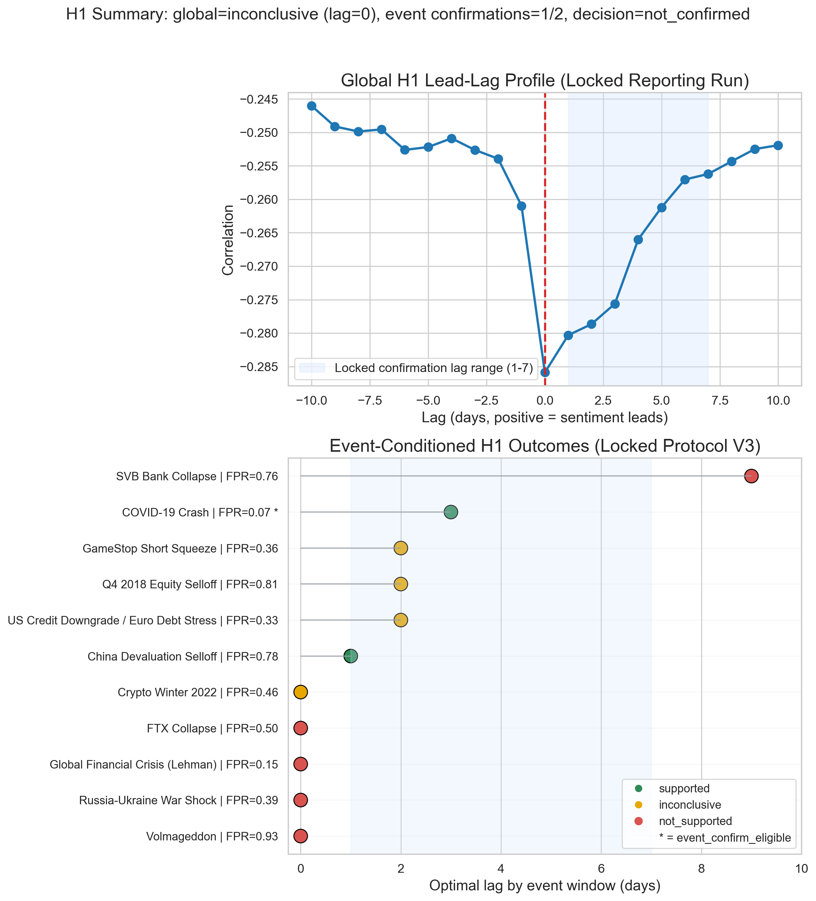
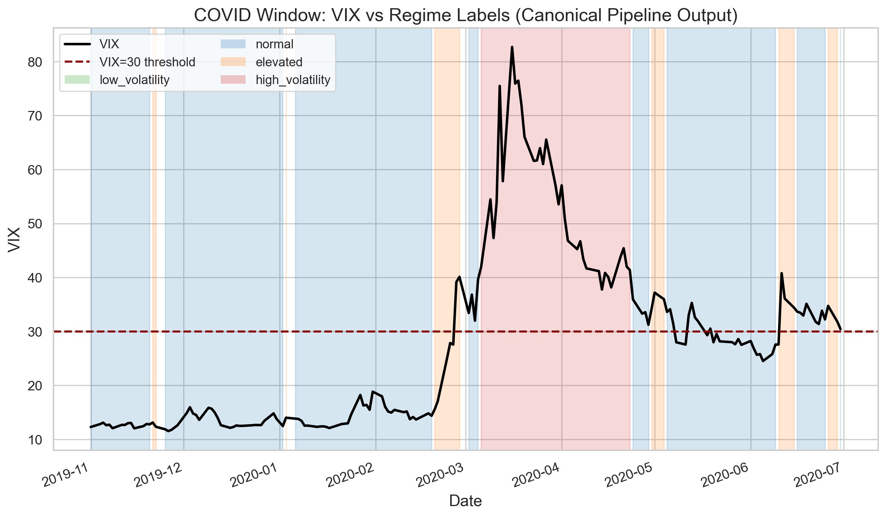
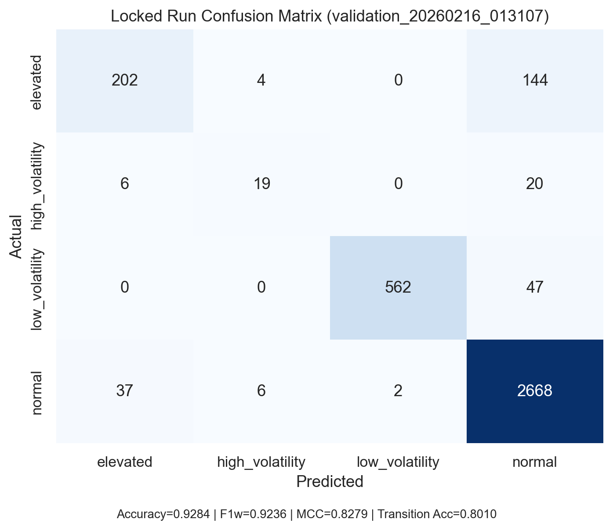
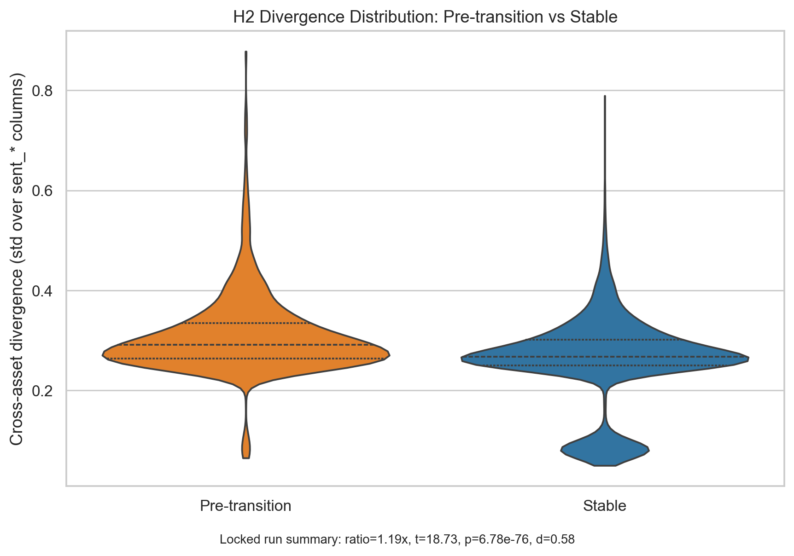
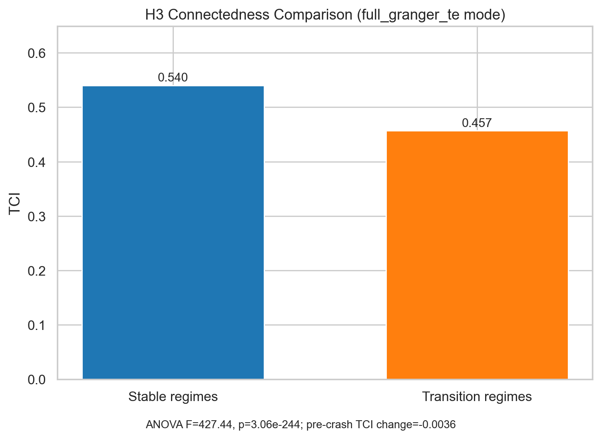

# Draft-2 Review: Sections 3 (Methods) and 5 (Results)

Source reviewed: `JonathanRocha-MSDS-Capstone-draft-2.docx` (extracted text at `JonathanRocha-MSDS-Capstone-draft-2-extracted.txt`)

## Findings (ordered by severity)

1. **High: Methods and Results under-cite the literature that Section 2 uses to justify design choices.**  
   - Evidence: no study citations appear throughout most of Section 3 and Section 5.  
   - Why this matters: your advisor's point is correct; design and interpretation read as implementation notes rather than literature-grounded research argument.  
   - Locations: `JonathanRocha-MSDS-Capstone-draft-2-extracted.txt:289-329`, `...:335-441`.

2. **High: Key methodological decisions are listed but not always justified as responses to known literature limitations.**  
   - Example: Jump Model persistence is described technically but not tied back to HMM over-switching/whipsaw evidence from Section 2.4.  
   - Locations: `...:300-307` (Methods), supported literature at `...:66`.

3. **High: H1/H2/H3 tests are reported as outcomes, but each result is not explicitly connected back to prior empirical expectations in Section 2.2-2.5.**  
   - Example: H1 "not confirmed" is clear, but the text does not explicitly reconcile this with mixed literature findings on lead times and next-day unpredictability.  
   - Locations: `...:343-351`, `...:380-405`, literature anchors `...:21-23`, `...:56`, `...:112-114`.

4. **Medium: Section 3 has places where notation and implementation detail are too compressed for readers outside the codebase.**  
   - Example: references to script paths and feature names are useful for reproducibility, but methodological meaning (what each feature captures and why it matters) is short.  
   - Locations: `...:293-299`, `...:309-322`.

5. **Medium: Section 5 tables report strong statistics but do not provide enough contextual interpretation (effect-size significance vs practical relevance).**  
   - Example: H2 and H3 support is numerically strong, but implications for regime detection behavior could be clearer.  
   - Locations: `...:339-377`.

## Citation Integration Map (Section 2 -> Sections 3/5)

- **Section 3.2 (feature engineering/time alignment):** cite Cai et al. (2024) and Shao et al. (2024) for mixed-frequency alignment and computational trade-offs.  
- **Section 3.3 (two-layer model):** cite Shi (2025) for sentiment-informed volatility modeling and Shu et al. (2024) for Jump Model persistence vs HMM instability.  
- **Section 3.5 (hypothesis tests):**  
  - H1 diagnostics: Bollen et al. (2011), Renault (2017), Kraaijeveld and De Smedt (2020), Trushkovskyi (2025).  
  - H2 diagnostics: Caferra (2022), Wang et al. (2024).  
  - H3 diagnostics: Cao et al. (2025), Nyakurukwa and Seetharam (2025), Sibande et al. (2021).  
- **Section 5 interpretation:**  
  - H1 non-confirmation context: Kengmegni (2024).  
  - H2/H3 support context: Caferra (2022), Cao et al. (2025), Nyakurukwa and Seetharam (2025).

## Paste-Ready Revision (Section 3)

### 3. Methods
#### 3.1 Study Design and Data
This study uses a daily-frequency, multi-source sentiment and market-data design over a unified window (2005-01-19 to 2025-08-14). The canonical pipeline produces 4,490 market-aligned observations and 22 engineered features before regime assignment (`results/pipeline_output/pipeline_summary.json`). The design prioritizes portfolio-level regime inference over single-security next-day prediction, consistent with evidence that aggregate sentiment can be more informative than stock-level signals for market-state analysis (Kengmegni, 2024).

The empirical pipeline consumes pre-aggregated daily sentiment and aligned stress/market series. Core market inputs are SPY returns, VIX, and ECB CISS; sentiment inputs include compound polarity and cross-asset/source components scored prior to regime modeling. This paper therefore focuses on the implemented feature-to-regime workflow and hypothesis diagnostics rather than re-documenting raw text ingestion.

#### 3.2 Feature Engineering and Time Alignment
Feature construction is implemented in `scripts/hpc/run_analysis.py`. Sentiment and market series are aligned to a common trading-day index, with controlled forward-fill handling for missing observations. This mixed-frequency harmonization is motivated by prior evidence that sentiment timing structure materially affects predictive behavior and error profiles (Cai et al., 2024), while computational burden can vary substantially by extraction stack (Shao et al., 2024).

Engineered features include:  
1) sentiment level/polarity (`compound`, `positive`, `negative`),  
2) dispersion/divergence (`cross_asset_std`, `sent_dispersion`, `max_divergence`),  
3) market risk (`returns`, `realized_vol`, `vix`, `vix_change`, `ciss`, `ciss_change`), and  
4) temporal dynamics (`sent_momentum`, `sent_acceleration`).

Let $s_{c,t}$ denote daily sentiment for asset class $c \in \{1,\dots,C\}$ on day $t$. Aggregate sentiment and divergence are defined as:

$$
\bar{s}_t = \frac{1}{C}\sum_{c=1}^{C}s_{c,t}, \qquad D_t = \max_c s_{c,t} - \min_c s_{c,t}.
$$

Temporal dynamics are defined with first and second differences:

$$
\Delta \bar{s}_t = \bar{s}_t - \bar{s}_{t-1}, \qquad \Delta^2 \bar{s}_t = \Delta \bar{s}_t - \Delta \bar{s}_{t-1}.
$$

For connectedness, two modes are evaluated: a proxy baseline and an upgraded `full_granger_te` mode computing rolling Granger/transfer-entropy diagnostics. This follows the nonlinear spillover literature showing that entropy-style connectedness features capture cross-market transmission missed by simpler linear formulations (Caferra, 2022).

#### 3.3 Two-Layer Regime Modeling
The model is implemented as a two-layer architecture. Layer 1 estimates conditional volatility features using a fitted GARCH(1,1) specification (`arch` backend). Layer 2 applies a Statistical Jump Model (JM) that segments the multivariate trajectory into persistent states by penalizing excessive switching.

Layer 1 volatility follows:

$$
r_t = \mu + \epsilon_t,\quad \epsilon_t = \sigma_t z_t,\quad z_t \sim \mathcal{N}(0,1),
$$
$$
\sigma_t^2 = \omega + \alpha \epsilon_{t-1}^2 + \beta \sigma_{t-1}^2,\quad \omega>0,\ \alpha,\beta\ge0,\ \alpha+\beta<1.
$$

Layer 2 Jump Model estimation solves:

$$
\min_{\Theta,\mathbf{s}} \sum_{t=0}^{T-1}\ell(x_t,\theta_{s_t}) + \lambda \sum_{t=1}^{T-1}\mathbb{I}(s_t \neq s_{t-1}),
$$

where $\lambda$ is the jump penalty controlling regime persistence.

This design is literature-grounded in two ways. First, sentiment-informed volatility structure is motivated by GARCH-MIDAS evidence in commodity settings (Shi, 2025). Second, the jump-penalty mechanism addresses documented HMM over-switching and whipsaw behavior, improving persistence and risk-usable regime labeling (Shu et al., 2024). The implemented state mapping uses four stress-ordered regimes: `low_volatility`, `normal`, `elevated`, and `high_volatility`.

#### 3.4 Validation Protocol
Out-of-sample evaluation uses walk-forward validation (`scripts/run_canonical_validation.py`) with a 756-day train window, 63-day test window, 63-day step, and 5-day purge gap. Each window retrains to reduce temporal leakage and concept-drift effects. The canonical classifier is a balanced random forest with 300 estimators.

Primary metrics are weighted accuracy, weighted precision/recall/F1, MCC, and transition accuracy. Transition accuracy is emphasized because the research objective is transition detection, not only static state assignment.

#### 3.5 Hypothesis Testing Framework
Hypothesis diagnostics are implemented in `src/sentiment_detector/validation/hypothesis_validator.py`.

- **H1 (leading indicator):** tested via lead-lag cross-correlation, Granger causality, and event-conditioned warning diagnostics against VIX stress behavior. This test structure follows prior lead-lag and Granger evidence in equities and crypto contexts (Bollen et al., 2011; Renault, 2017; Kraaijeveld & De Smedt, 2020; Trushkovskyi, 2025). The cross-correlation diagnostic is:

$$
\rho_{SV}(k) = \mathrm{Corr}(S_{t-k},V_t), \qquad \hat{k}=\arg\max_{k\in\{0,\dots,5\}}|\rho_{SV}(k)|.
$$

- **H2 (divergence signal):** tested by comparing pre-transition vs stable-period divergence with t-tests and effect-size reporting, consistent with cross-asset spillover asymmetry literature (Caferra, 2022; Wang et al., 2024):

$$
t = \frac{\bar{D}_{\mathrm{pre}} - \bar{D}_{\mathrm{stable}}}
{\sqrt{\frac{s^2_{\mathrm{pre}}}{n_{\mathrm{pre}}}+\frac{s^2_{\mathrm{stable}}}{n_{\mathrm{stable}}}}}.
$$

- **H3 (network effect):** tested with ANOVA-style connectedness separation under proxy and full-network modes, aligned with connectedness/crash-risk and state-dependent sentiment evidence (Cao et al., 2025; Nyakurukwa & Seetharam, 2025; Sibande et al., 2021):

$$
F = \frac{MS_{\mathrm{between}}}{MS_{\mathrm{within}}}.
$$

The locked H1 confirmation protocol is executed via `scripts/run_h1_locked_confirmation.py` and documented in `docs/H1_LOCKED_CONFIRMATION_PROTOCOL.md`.

#### 3.6 Reproducibility
The study uses fixed reporting configuration and manifest-tracked outputs. Core artifacts are stored under `results/pipeline_output/` and `results/validation/`, with integrity traceability in `docs/RESULTS_MANIFEST.json`. Appendix A reports run commands and registry identifiers to preserve narrative flow in the main text.

#### 3.7 Dashboard and Deployment Context
The system is exposed through a FastAPI backend and Next.js dashboard (Railway/Vercel deployment) to provide reproducible visibility into sentiment, regimes, transitions, and explainability payloads. This implementation context is included because the contribution is both methodological and operational.

#### 3.8 Canonical Validation Execution (Locked Reporting Run)
Reported results are anchored to the canonical feature matrix and labels from `results/pipeline_output/`, with walk-forward retraining under fixed window rules, baseline volatility mode for top-line comparability, and upgraded connectedness diagnostics for H3 sensitivity checks.

## Paste-Ready Revision (Section 5)

### 5. Results
#### 5.1 Primary Outcomes
The canonical run shows strong out-of-sample regime classification: Accuracy = 0.9284, weighted Precision = 0.9252, weighted Recall = 0.9284, weighted F1 = 0.9236, MCC = 0.8279, and Transition Accuracy = 0.8010.

At the hypothesis level, evidence supports H2 and H3 but does not confirm H1 under the project’s locked global rule (Table 5.1). This pattern is directionally consistent with Section 2: divergence and network structure appear robust cross-asset mechanisms (Caferra, 2022; Cao et al., 2025; Nyakurukwa & Seetharam, 2025), while broad lead-time generalization remains difficult outside specific episodes (Kengmegni, 2024).

| Hypothesis | Result | Key Diagnostic Evidence |
| --- | --- | --- |
| H1 (Leading Indicator) | Not confirmed | Strongest lead-lag alignment at lag 0; global confirmation criteria for a 1-5 day lead not met |
| H2 (Divergence Signal) | Supported | Pre-transition divergence > stable divergence (ratio 1.19x; $t=18.73$, $p<0.001$, Cohen's $d=0.58$) |
| H3 (Network Effect) | Supported | Stable-regime connectedness > transition connectedness (TCI 0.5402 vs. 0.4569; ANOVA $F=427.44$, $p<0.001$) |

#### 5.2 Robustness and Sensitivity Synthesis
Robustness checks were run across lag-feature settings, walk-forward window geometry, purge-gap controls, volatility-mode variants, connectedness-mode variants, and subperiod slices.

| Robustness Dimension | Main Observation | Implication |
| --- | --- | --- |
| Lagged sentiment features | Higher aggregate Accuracy/F1/MCC; lower transition accuracy | Improves static discrimination but does not establish H1 lead-time confirmation |
| Walk-forward windows | Shorter test/step windows improved aggregate metrics; larger train windows did not improve transitions | Model quality is window-sensitive, but hypothesis direction is stable |
| Purge-gap controls | Larger purge slightly reduced aggregate metrics; hypothesis outcomes unchanged | H1/H2/H3 interpretation is not driven by leakage-control choice in tested ranges |
| Volatility mode | `garch_midas_ciss` did not outperform baseline in this configuration | Baseline volatility representation retained for manuscript reporting |
| Network mode | Full connectedness mode preserved top-line performance and improved transition accuracy slightly | H3 support is robust to connectedness-construction choice |
| Subperiod checks | Pre-2020 segment remains most informative; short post-2020 slices are low-power | Recent perfect scores are interpreted as small-sample artifacts |

#### 5.3 Locked H1 Confirmation
Global H1 remains unconfirmed across the full locked sequence (V1-V3). Only one event window (COVID-19 crash) met strict support criteria, while project-level confirmation required at least two event-confirmed windows. The result indicates conditional/event-specific lead behavior without generalizable portfolio-level lead confirmation under fixed rules.

This non-confirmation should be interpreted as boundary-setting rather than model failure: the framework still demonstrates strong regime discrimination and consistent H2/H3 support, but does not justify a broad claim of 1-5 day leading behavior relative to VIX in all market contexts.

| Protocol | Rule Variant | Global Outcome | Event-Confirmed Windows | Project-Level Decision |
| --- | --- | --- | --- | --- |
| V1 | Base event set, 1-5 day confirmation horizon | Inconclusive global lag pattern | 1 | Not confirmed |
| V2 | Expanded event universe (11 events) | Inconclusive global lag pattern | 1 | Not confirmed |
| V3 | Horizon extension to 1-7 days | Inconclusive global lag pattern | 1 | Not confirmed |

#### 5.4 Figures and Evidence Traceability
Figures 5.4.1-5.4.5 summarize global/event-conditioned lead behavior, regime-VIX alignment, transition classification, divergence separation, and connectedness separation. Appendix A provides command-level provenance and run registries linking each figure/table to manifest-tracked artifacts.

**Figure 5.4.1. H1 lead-time summary (global and event-conditioned).**  
Interpretation: the global curve peaks at lag 0, while event-conditioned windows show localized positive lead behavior that is insufficient for project-level H1 confirmation.

**Figure 5.4.2. Regime labels vs. VIX in the COVID stress window.**  
Interpretation: JM regime escalation aligns with stress buildup around the COVID period; local lead behavior appears in this window but does not generalize across all tested events.

**Figure 5.4.3. Transition-performance confusion matrix.**  
Interpretation: confusion is concentrated near adjacent stress states, while major regime classes remain well separated, consistent with high aggregate MCC and transition accuracy.

**Figure 5.4.4. H2 divergence distribution (pre-transition vs. stable periods).**  
Interpretation: pre-transition divergence mass shifts upward relative to stable periods, matching the reported positive effect size and statistically significant t-test.

**Figure 5.4.5. H3 connectedness comparison (stable vs. transition regimes).**  
Interpretation: stable regimes show higher connectedness than transition regimes, supporting the network-separation result under both proxy and full connectedness modes.

#### 5.5 Results Synthesis
The empirical contribution is a reproducible cross-asset regime-detection workflow with consistent support for divergence (H2) and connectedness (H3) mechanisms under canonical and robustness settings. H1 remains unconfirmed at the global level under pre-registered criteria, so lead-time interpretation is intentionally bounded to directional behavior in selected stress episodes.
