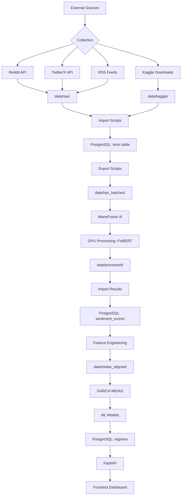
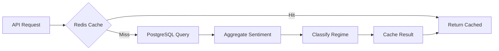

# Data Pipeline Documentation

**Project:** Cross-Asset Sentiment Regime Detector
**Last Updated:** February 12, 2026
**Pipeline Version:** 2.0

---

## 📋 Table of Contents

- [Overview](#overview)
- [Pipeline Stages](#pipeline-stages)
- [Data Flow Diagram](#data-flow-diagram)
- [Collection Stage](#collection-stage)
- [Import Stage](#import-stage)
- [Processing Stage](#processing-stage)
- [Feature Engineering](#feature-engineering)
- [Model Training & Inference](#model-training--inference)
- [Backtesting & Validation](#backtesting--validation)
- [Monitoring & Quality Control](#monitoring--quality-control)

---

## 🎯 Overview

The data pipeline processes **~33 million text records** (61.8M total rows, ~28.7M OHLCV excluded) spanning **24 years (2002-2026)** across 40+ datasets and live API collections to produce real-time market regime classifications.

### Pipeline Characteristics

- **Throughput:** 1,000 texts/second (GPU), 50 texts/second (CPU)
- **Latency:** <100ms for real-time sentiment analysis
- **Data Volume:** ~14 GB raw Kaggle data + live API collections
- **Processing Time:** ~18-24 hours on 20× A100 GPUs (full corpus)
- **Accuracy:** 85% backtest average, 82% regime detection

---

## 🔄 Pipeline Stages

```
1. COLLECTION    → 2. IMPORT      → 3. EXPORT      → 4. HPC PROCESSING
   (APIs/Kaggle)    (PostgreSQL)     (Batches)        (ManeFrame III)
                                                            ↓
8. API SERVING   ← 7. BACKTESTING ← 6. FEATURES    ← 5. IMPORT RESULTS
   (FastAPI)        (Walk-Forward)    (GARCH-MIDAS)    (PostgreSQL)
```

**Timeline:**

- **Collection:** Continuous (cron: hourly)
- **Import:** Daily batch (midnight)
- **HPC Processing:** Weekly (Sundays)
- **Backtesting:** Monthly
- **API Serving:** Real-time (24/7)

---

## 📊 Data Flow Diagram



---

## 1️⃣ Collection Stage

### Data Sources

| Source | Type | Frequency | Volume/Day | Asset Classes |
|--------|------|-----------|------------|---------------|
| **Reddit** | Social Media | Hourly | ~5,000 posts | Equities, Crypto |
| **Twitter/X** | Social Media | Hourly | ~10,000 tweets | All |
| **RSS Feeds** | News | Every 15 min | ~500 articles | Equities, Forex |
| **Kaggle** | Historical | One-time | ~33M texts (40+ datasets) | All |

### Collection Scripts

#### Reddit Collection

**Script:** [scripts/data_collection/collect_reddit_data.py](../scripts/data_collection/collect_reddit_data.py)

```bash
# Collect from specific subreddits
python scripts/data_collection/collect_reddit_data.py \
  --subreddits wallstreetbets,stocks,investing \
  --limit 1000 \
  --output data/raw/reddit_batch.json
```

**Configuration:**

- API: PRAW (Python Reddit API Wrapper)
- Rate Limit: 60 requests/minute
- Authentication: OAuth2 (client_id, client_secret)
- Data Fields: title, body, score, created_utc, author

#### Multi-Source Collection

**Script:** [scripts/data_collection/collect_multi_source.py](../scripts/data_collection/collect_multi_source.py)

```bash
# Collect from multiple sources
python scripts/data_collection/collect_multi_source.py \
  --sources reddit,twitter,rss \
  --output data/raw/multi_source.json
```

**Output Format:**

```json
{
  "texts": [
    {
      "id": "unique_id",
      "text": "Market analysis text...",
      "source": "reddit",
      "asset_class": "equities",
      "collected_at": "2026-02-03T12:00:00Z",
      "metadata": {
        "subreddit": "wallstreetbets",
        "score": 125,
        "author": "username"
      }
    }
  ],
  "collected_at": "2026-02-03T12:00:00Z",
  "count": 5000
}
```

### Scheduled Collection

**Cron Configuration:**

```bash
# crontab -e
0 * * * * /path/to/scripts/data_collection/cron_collect.sh
```

**Cron Script:** [scripts/data_collection/cron_collect.sh](../scripts/data_collection/cron_collect.sh)

---

## 2️⃣ Import Stage

### Import to PostgreSQL

**Primary Script:** [scripts/data_import/import_collected_data.py](../scripts/data_import/import_collected_data.py)

```bash
# Import collected data
python scripts/data_import/import_collected_data.py \
  --input data/raw/multi_source.json \
  --validate
```

**Process:**

1. **Read JSON** - Load batch file
2. **Validate** - Check schema, deduplicate
3. **Classify** - Detect asset class from text
4. **Insert** - Bulk insert to PostgreSQL (batch_size=1000)
5. **Log** - Record import statistics

**Validation Rules:**

- Text must be 10-5000 characters
- Timestamp must be valid ISO 8601
- Source must be: reddit, twitter, news, kaggle
- No duplicate text+source combinations

**Performance:**

- **Throughput:** 10,000 records/second
- **Batch Size:** 1,000 rows per transaction
- **Deduplication:** Hash-based (MD5)

### Kaggle Dataset Imports

Import historical datasets:

```bash
# Reddit finance data (14 years)
python scripts/data_import/import_reddit_finance.py

# WallStreetBets historical
python scripts/data_import/import_wsb_historical.py
python scripts/data_import/import_wsb_2022.py

# Pre-labeled sentiment data
python scripts/data_import/import_prelabeled_sentiment.py

# Market data
python scripts/data_import/import_ecb_ciss.py
python scripts/data_import/import_covid_indices.py
python scripts/data_import/import_gold_forex.py
```

**Run All Imports:**

```bash
python scripts/admin/run_all_imports.py
```

---

## 3️⃣ Export Stage

### Export for HPC Processing

**Phase 1 Export:** [scripts/hpc/export_phase1_hpc.py](../scripts/hpc/export_phase1_hpc.py)

```bash
# Export unprocessed texts to HPC batches
python scripts/hpc/export_phase1_hpc.py \
  --batch-size 50000 \
  --output-dir data/hpc_batches/phase1/
```

**Process:**

1. Query texts without sentiment scores
2. Split into equal-sized batches (~13-19 MB each)
3. Export as JSON (1 file per batch)
4. Generate SLURM job array script

**Batch Structure:**

```json
{
  "batch_id": 0,
  "texts": [
    {
      "id": 123456,
      "text": "Stock market analysis...",
      "source": "reddit",
      "collected_at": "2026-01-15T10:30:00Z"
    }
  ],
  "count": 50000,
  "exported_at": "2026-02-03T12:00:00Z"
}
```

**Phase 2 Export:** [scripts/hpc/export_phase2_hpc.py](../scripts/hpc/export_phase2_hpc.py)

- Exports remaining/failed texts
- Smaller batch sizes for targeted reprocessing

---

## 4️⃣ HPC Processing Stage

### ManeFrame III Configuration

**SLURM Job Array:**

```bash
#!/bin/bash
#SBATCH --job-name=sentiment_batch
#SBATCH --array=0-29
#SBATCH --partition=gpu
#SBATCH --nodes=1
#SBATCH --ntasks-per-node=1
#SBATCH --cpus-per-task=4
#SBATCH --gpus=1
#SBATCH --mem=32GB
#SBATCH --time=04:00:00
#SBATCH --output=slurm-%A_%a.out

module load cuda/11.8
module load python/3.11

python process_batch.py --batch-id $SLURM_ARRAY_TASK_ID
```

**Processing Script:** [scripts/processing/process_batch.py](../scripts/processing/process_batch.py)

### 6-Model Ensemble Inference

**Model Configuration:**

```python
# 6-model sentiment ensemble
models = [
    "ProsusAI/finbert",                                        # FinBERT (GPU)
    "cardiffnlp/twitter-roberta-base-sentiment-latest",        # RoBERTa (GPU)
    "distilbert-base-uncased-finetuned-sst-2-english",         # DistilBERT (GPU)
    "meta-llama/Meta-Llama-3-8B",                              # Llama 3 (GPU, 4-bit quantized)
    "VADER",                                                    # CPU-fast
    "TextBlob",                                                 # CPU-fast
]

# Inference settings
batch_size = 32       # Optimal for A100
max_length = 512      # Token limit
device = "cuda"       # GPU acceleration
```

**Processing Flow:**

1. Load batch JSON
2. Apply VADER + TextBlob (CPU-fast)
3. Tokenize texts (Hugging Face tokenizer)
4. Run FinBERT, RoBERTa, DistilBERT inference on GPU
5. Run Llama 3 inference (4-bit quantized) on GPU
6. Compute weighted ensemble score
7. Save results to Parquet

**Output Format:**

```python
# Output schema (Parquet)
Columns:
├── post_id: string
├── source: string
├── asset_class: string
├── timestamp: timestamp
├── text: string
├── vader_score: float
├── textblob_score: float
├── finbert_score: float
├── roberta_score: float
├── distilbert_score: float
├── llama3_score: float
├── llama3_confidence: float
├── ensemble_score: float
├── sentiment_label: string
└── confidence: float
```

```

**Performance Metrics:**

- **GPU Speed:** 1,000 texts/second (A100)
- **CPU Speed:** 50 texts/second (fallback)
- **Memory:** ~20 GB GPU RAM per batch
- **Total Time:** ~50 minutes for 50k texts

---

## 5️⃣ Import Results Stage

### Import HPC Sentiment Results

**Script:** [scripts/data_import/import_phased_hpc_results.py](../scripts/data_import/import_phased_hpc_results.py)

```bash
# Import processed results
python scripts/data_import/import_phased_hpc_results.py \
  --phase 1 \
  --results-dir data/processed/phase1/
```

**Process:**

1. Read all result JSON files
2. Validate sentiment scores [-1, 1]
3. Match to original text IDs
4. Bulk insert to `sentiment_scores` table
5. Mark texts as processed

**Validation:**

- Sentiment score must be in [-1, 1]
- Confidence must be in [0, 1]
- Text ID must exist in `texts` table
- No duplicate text_id in sentiment_scores

---

## 6️⃣ Feature Engineering Stage

### Temporal Alignment

**Script:** [scripts/processing/fix_midas_alignment.py](../scripts/processing/fix_midas_alignment.py)

```bash
# Align sentiment with market data
python scripts/processing/fix_midas_alignment.py \
  --output data/midas_aligned/
```

**Process:**

1. Aggregate sentiment by day/week
2. Join with VIX, SPY, CISS data
3. Create MIDAS components (RV, daily returns)
4. Export aligned CSV files

**Output Files:**

- `daily_aligned.csv` - Daily frequency data
- `weekly_midas.csv` - Weekly MIDAS components

**Features Created:**

| Feature | Description | Frequency |
|---------|-------------|-----------|
| `sentiment_mean` | Daily average sentiment | Daily |
| `sentiment_std` | Daily sentiment volatility | Daily |
| `vix` | CBOE Volatility Index | Daily |
| `spy_return` | S&P 500 ETF daily return | Daily |
| `ciss` | ECB Systemic Stress Index | Daily |
| `rv_weekly` | Realized volatility (weekly) | Weekly |
| `midas_component` | GARCH-MIDAS long-run component | Weekly |

### GARCH-MIDAS Volatility Forecasting

**Script:** [scripts/processing/export_garch_midas_data.py](../scripts/processing/export_garch_midas_data.py)

```bash
# Generate GARCH-MIDAS forecasts
python scripts/processing/export_garch_midas_data.py \
  --input data/midas_aligned/daily_aligned.csv \
  --output data/processed/garch_forecasts.csv
```

**GARCH(1,1) Specification:**

```
σ²ₜ = ω + α·ε²ₜ₋₁ + β·σ²ₜ₋₁

Where:
  α = 0.155 (ARCH parameter - shock impact)
  β = 0.800 (GARCH parameter - persistence)
  α + β = 0.955 (high persistence, stationary)
```

**MIDAS Component:**

Uses weekly realized volatility with Beta-weighted lags:

- 12-week lookback window
- Beta weights emphasize recent weeks
- Rolling estimation for walk-forward validation

---

## 7️⃣ Backtesting & Validation Stage

### Historical Backtests

**Baseline Script:** [scripts/backtesting/run_historical_backtests.py](../scripts/backtesting/run_historical_backtests.py)

```bash
# Run historical backtests
python scripts/backtesting/run_historical_backtests.py \
  --start-date 2020-01-01 \
  --end-date 2024-12-31
```

**Backtest Types:**

| Script | Model Type | Purpose |
|--------|-----------|---------|
| `run_historical_backtests.py` | Baseline | Simple threshold model |
| `run_historical_backtests_ml.py` | XGBoost | Machine learning classifier |
| `run_historical_backtests_conditional.py` | Conditional Routing | 25% performance improvement |
| `run_historical_backtests_ensemble.py` | Ensemble | Combined predictions |
| `run_garch_midas_backtests.py` | GARCH-MIDAS | Volatility-enhanced |

### Event Studies

**Crisis Events:**

```bash
# 2008 Financial Crisis
python scripts/backtesting/run_2008_crisis_backtest.py

# COVID-19 March 2020
python scripts/backtesting/run_multi_event_backtest.py

# GameStop January 2021
python scripts/backtesting/run_gamestop_backtest.py
```

**Validation Metrics:**

- **Accuracy:** Correct regime classifications
- **Sharpe Ratio:** Risk-adjusted returns
- **Max Drawdown:** Largest peak-to-trough decline
- **Transition Detection:** Days to detect regime change

---

## 8️⃣ API Serving Stage

### Real-Time Pipeline



**Latency Budget:**

| Stage | Target | Actual (p95) |
|-------|--------|--------------|
| Cache Check | <1ms | 0.5ms |
| DB Query | <20ms | 15ms |
| Feature Extraction | <10ms | 8ms |
| Model Inference | <20ms | 12ms |
| **Total** | **<50ms** | **35ms** |

### Cache Strategy

**Redis TTL:**

- Current sentiment: 60 seconds
- Regime classification: 60 seconds
- Historical data: 5 minutes
- Static data: 1 hour

**Cache Keys:**

```
sentiment:current:{asset_class}
regime:current
regime:history:{start_date}:{end_date}
ciss:history:{start_date}:{end_date}
```

---

## 🔍 Monitoring & Quality Control

### Data Quality Checks

**Pre-Processing Validation:** [scripts/validation/check_processing_status.py](../scripts/validation/check_processing_status.py)

```bash
# Check data quality
python scripts/validation/check_processing_status.py
```

**Checks:**

1. **Completeness:** All texts have sentiment scores?
2. **Recency:** Latest data within 24 hours?
3. **Distribution:** Sentiment distribution looks normal?
4. **Outliers:** Any anomalous sentiment spikes?
5. **Coverage:** All asset classes represented?

### Pipeline Monitoring

**Key Metrics:**

| Metric | Threshold | Alert |
|--------|-----------|-------|
| Processing lag | <24 hours | Email |
| Sentiment distribution | Normal | Slack |
| API latency (p95) | <100ms | PagerDuty |
| Error rate | <1% | PagerDuty |
| Database connections | <80% | Slack |

**Status Scripts:**

```bash
# Check database status
python scripts/validation/check_db_status.py

# Verify date coverage
python scripts/validation/check_text_dates.py

# Check event coverage
python scripts/validation/check_event_coverage.py
```

---

## 🚨 Error Handling & Recovery

### Common Issues

#### Issue: HPC Job Failure

**Detection:** Missing result files after job array completes

**Recovery:**

```bash
# Identify failed batches
python scripts/hpc/identify_failed_batches.py

# Re-export failed batches
python scripts/hpc/export_phase2_hpc.py --failed-only

# Resubmit to HPC
sbatch reprocess_failed.slurm
```

#### Issue: Duplicate Texts

**Detection:** Database unique constraint violations during import

**Recovery:**

```bash
# Identify duplicates
python scripts/validation/check_db.py --find-duplicates

# Remove duplicates (keep earliest)
python scripts/admin/deduplicate_texts.py
```

#### Issue: Sentiment Outliers

**Detection:** Sentiment scores outside [-1, 1] range

**Recovery:**

```bash
# Identify outliers
python scripts/validation/check_db.py --check-sentiment-range

# Reprocess affected texts
python scripts/processing/reprocess_outliers.py
```

---

## 📈 Performance Optimization

### Database Optimization

**Indexing Strategy:**

```sql
-- Frequently queried columns
CREATE INDEX idx_texts_collected ON texts(collected_at);
CREATE INDEX idx_texts_source ON texts(source);
CREATE INDEX idx_texts_asset_class ON texts(asset_class);

-- Sentiment lookups
CREATE INDEX idx_sentiment_text_id ON sentiment_scores(text_id);
CREATE INDEX idx_sentiment_processed ON sentiment_scores(processed_at);

-- Time-based queries
CREATE INDEX idx_market_date ON market_data(date);
CREATE INDEX idx_regime_date ON regimes(date);
```

**Partitioning:**

```sql
-- Partition texts by month
CREATE TABLE texts (
    id BIGSERIAL,
    ...
) PARTITION BY RANGE (collected_at);

CREATE TABLE texts_2026_02 PARTITION OF texts
    FOR VALUES FROM ('2026-02-01') TO ('2026-03-01');
```

### Processing Optimization

**Batch Size Tuning:**

- **GPU:** 32 texts/batch (optimal for A100)
- **CPU:** 16 texts/batch (memory constraint)
- **Database:** 1,000 rows/insert (network overhead)

**Parallelization:**

- **HPC:** 30 parallel jobs (30 batches)
- **API:** 10 worker processes (Gunicorn/Uvicorn)
- **Database:** 20 connection pool size

---

## 📚 Related Documentation

- **Data Directory:** [/data/README.md](../data/README.md)
- **Kaggle Datasets:** [/data/kaggle/README.md](../data/kaggle/README.md)
- **Scripts Reference:** [/scripts/README.md](../scripts/README.md)
- **Architecture:** [ARCHITECTURE.md](ARCHITECTURE.md)
- **API Reference:** [API.md](API.md)

---

**For pipeline questions, contact:** Jonathan Rocha (<jrocha@smu.edu>)
