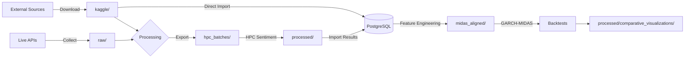

# Data Directory Documentation

**Project:** Cross-Asset Sentiment Regime Detector
**Last Updated:** February 3, 2026
**Total Storage:** ~4.5 GB across 6 primary directories

---

## 📊 Overview

This directory contains all data assets for the sentiment regime detection system, organized by processing stage and purpose. The pipeline processes 2.66 million texts spanning 2002-2026 across multiple asset classes (equities, crypto, forex, commodities).

---

## 🗂️ Directory Structure

```text
data/
├── kaggle/              # 21 Kaggle datasets (2.8 GB) - External data sources
├── raw/                 # Raw collected data (2.9 MB) - API collections
├── processed/          # Analysis results (830 MB) - Sentiment + backtests
├── hpc_batches/        # HPC processing batches (675 MB) - Parallel processing
├── midas_aligned/      # GARCH-MIDAS data (390 KB) - Volatility modeling
└── reference-repos/    # External reference repos - Research codebases
```

---

## 📈 Data Pipeline Flow



**Stage Breakdown:**

1. **Collection** → `kaggle/` and `raw/`
2. **Export for HPC** → `hpc_batches/` (batches prepared for ManeFrame III)
3. **HPC Processing** → Sentiment analysis on SMU's HPC cluster
4. **Import Results** → `processed/` (sentiment scores, features)
5. **Database Loading** → PostgreSQL (structured storage)
6. **Feature Engineering** → `midas_aligned/` (daily/weekly aligned data)
7. **Backtesting** → `processed/historical_backtests*/` (strategy evaluation)
8. **Visualization** → `processed/comparative_visualizations/` (charts)

---

## 📁 Directory Details

### `/kaggle/` - External Datasets (2.8 GB)

Downloaded datasets from Kaggle, organized by source and asset class.

| Directory | Size | Purpose | Date Range |
|-----------|------|---------|------------|
| `huggingface/` | 2.0 GB | Pre-labeled FinBERT datasets | Various |
| `wsb-echo-chamber/` | 1.5 GB | WallStreetBets echo chamber analysis | 2021-2022 |
| `reddit-finance/` | 1.2 GB | r/investing, r/stocks, r/finance | 2010-2024 |
| `crypto-reddit/` | 445 MB | r/cryptocurrency, r/bitcoin | 2017-2024 |
| `crypto/` | 425 MB | Crypto market sentiment | 2017-2024 |
| `wsb-2022/` | 211 MB | WallStreetBets 2022 | 2022 |
| `wsb/` | 42 MB | WallStreetBets historical | 2020-2021 |
| `stock_tweets/` | 18 MB | Stock-related tweets | 2015-2020 |
| `stocknews/` | 14 MB | Stock market news | 2018-2023 |
| `reddit-sentiment-2025/` | 11 MB | Recent Reddit sentiment | 2024-2025 |
| `covid-world-indices/` | 5.8 MB | COVID-19 era market indices | 2020-2022 |
| `forex/` | 4.1 MB | Foreign exchange data | 2010-2024 |
| `crypto-tweets/` | 3.1 MB | Cryptocurrency tweets | 2017-2021 |
| `stock_news/` | 2.6 MB | Financial news headlines | 2015-2023 |
| `financial-news/` | 2.6 MB | General financial news | 2010-2023 |
| `financial-news-nlp-2025/` | 2.0 MB | NLP-processed financial news | 2024-2025 |
| `commodity-gold/` | 1.9 MB | Gold commodity prices | 2000-2024 |
| `ecb-ciss/` | 424 KB | ECB Composite Indicator of Systemic Stress | 2000-2026 |
| `social-sentiment/` | 384 KB | Cross-platform social sentiment | 2020-2024 |

**Import Scripts:** See [scripts/data_import/](../scripts/data_import/)

**Key Redundancies to Investigate:**
- `stock_news/` vs `stocknews/` - Potential duplicates?
- `financial-news/` vs `financial-news-nlp-2025/` - Different processing?
- Multiple Reddit datasets with potential temporal overlap
- Multiple crypto sources (tweets, reddit, market data)

> **Note:** Full dataset audit with overlap analysis pending (see Task 9)

---

### `/raw/` - Raw Collected Data (2.9 MB)

Original JSON files from live data collection APIs (Reddit, Twitter/X, RSS feeds).

| File | Size | Description |
|------|------|-------------|
| `large_collection.json` | 901 KB | Large multi-source collection |
| `full_multi_source.json` | 762 KB | Combined API sources |
| `kaggle_rss_combined.json` | 752 KB | Combined RSS feeds from Kaggle |
| `sample_batch.json` | 598 KB | Test batch for pipeline validation |
| `multi_source.json` | 32 KB | Small multi-source test |
| `scheduled/` | 136 KB | Cron-scheduled collections |

**Collection Scripts:**
- [scripts/data_collection/collect_reddit_data.py](../scripts/data_collection/collect_reddit_data.py)
- [scripts/data_collection/collect_multi_source.py](../scripts/data_collection/collect_multi_source.py)
- [scripts/data_collection/cron_collect.sh](../scripts/data_collection/cron_collect.sh)

**Data Flow:**
APIs → `raw/*.json` → PostgreSQL → HPC batches → Sentiment analysis

---

### `/processed/` - Analysis Results (830 MB)

Sentiment analysis outputs, backtest results, and generated visualizations.

#### Sentiment Results (Phase 1 & 2)

| File | Size | Description |
|------|------|-------------|
| `phase1_results.json` | 197 MB | Phase 1 HPC sentiment results |
| `phase2/` | 404 MB | Phase 2 HPC sentiment results (13 batches) |
| `kaggle_sentiment_full.json` | 223 MB | Full Kaggle sentiment (2.66M texts) |
| `kaggle_sentiment_5k.json` | 5.8 MB | 5,000 text sample |
| `kaggle_sentiment_test.json` | 1.2 MB | Test set results |

#### ManeFrame HPC Results

| Directory | Size | Description |
|-----------|------|-------------|
| `maneframe_output/` | 129 MB | Raw HPC job outputs |
| `maneframe_batches/` | 89 MB | Batch processing results |

#### Backtest Results

| Directory | Size | Description |
|-----------|------|-------------|
| `historical_backtests_ml/` | 896 KB | ML-based backtests (10 periods) |
| `historical_backtests_conditional/` | 968 KB | Conditional routing backtests |
| `historical_backtests/` | 820 KB | Baseline historical backtests |
| `historical_backtests_ensemble/` | 20 KB | Ensemble model backtests |

**Key Backtest Files:**
- `crisis_2008_backtest_results.csv` - 2008 financial crisis analysis
- `gamestop_backtest_results.csv` - GameStop January 2021 event
- `multi_event_backtest_summary.json` - Multi-period comparison
- `COMPREHENSIVE_BACKTEST_COMPARISON.md` - Summary report

#### Regime Data

| File | Size | Description |
|------|------|-------------|
| `vix_regimes_extended.json` | 969 KB | VIX regimes 2000-2026 |
| `vix_regimes.json` | 553 KB | Standard VIX regimes |

#### Visualizations

| Directory | Size | Contents |
|-----------|------|----------|
| `comparative_visualizations/` | 1.1 MB | 6 comparative charts (PNG) |

---

### `/hpc_batches/` - HPC Processing (675 MB)

Batches prepared for parallel processing on SMU's ManeFrame III HPC cluster.

| Directory/Files | Size | Description |
|-----------------|------|-------------|
| `phase2/` | 313 MB | Phase 2 batches (13 batches) |
| `phase1/` | 362 MB | Phase 1 batches (30 batches) |
| `batch_0000.json` - `batch_0029.json` | ~13-19 MB each | Individual batch files |

**Batch Statistics:**
- **Total batches:** 30 (Phase 1)
- **Batch size:** ~13-19 MB per batch
- **Processing:** Parallel GPU-accelerated sentiment analysis
- **Target:** FinBERT transformer model on ManeFrame III A100 GPUs

**Export Scripts:**
- [scripts/hpc/export_phase1_hpc.py](../scripts/hpc/export_phase1_hpc.py)
- [scripts/hpc/export_phase2_hpc.py](../scripts/hpc/export_phase2_hpc.py)
- [scripts/hpc/package_for_hpc.sh](../scripts/hpc/package_for_hpc.sh)

**Import Scripts:**
- [scripts/data_import/import_hpc_sentiment.py](../scripts/data_import/import_hpc_sentiment.py)
- [scripts/data_import/import_phased_hpc_results.py](../scripts/data_import/import_phased_hpc_results.py)

---

### `/midas_aligned/` - GARCH-MIDAS Data (390 KB)

Temporally aligned data for GARCH-MIDAS volatility modeling.

| File | Size | Description |
|------|------|-------------|
| `daily_aligned.csv` | 318 KB | Daily-frequency aligned features |
| `weekly_midas.csv` | 80 KB | Weekly MIDAS components |

**Contents:**
- Daily VIX, SPY returns, sentiment scores
- Weekly aggregated MIDAS variables
- Aligned timestamps for volatility forecasting

**Export Script:**
- [scripts/hpc/export_aligned_midas_for_hpc.py](../scripts/hpc/export_aligned_midas_for_hpc.py)
- [scripts/processing/fix_midas_alignment.py](../scripts/processing/fix_midas_alignment.py)

---

### `/reference-repos/` - External References

Research repositories and reference implementations.

| Directory | Purpose |
|-----------|---------|
| `CryptoMarket_Regime_Classifier/` | Crypto market regime classification reference |

---

## 🔄 Data Retention & Archival Policy

### Active Data (Keep in `/data/`)

- **Kaggle datasets** - Permanent retention (source data)
- **Latest processed results** - Keep most recent phase outputs
- **Backtest results** - Retain all for comparison
- **MIDAS aligned data** - Keep current aligned datasets

### Archival Candidates (Move to `/archive/data/`)

- **Old HPC batches** - Archive after successful import to PostgreSQL
- **Intermediate test results** - Archive after validation complete
- **Superseded sentiment results** - Archive older phases when new phase completes
- **Sample/test batches** - Archive after pipeline validation

### Deletion Candidates

- **Raw collections** in `/raw/` after successful PostgreSQL import (backup first)
- **Temporary processing outputs** - Delete after merge into final results
- **Duplicate datasets** - Remove after redundancy audit (Task 9)

### Backup Strategy

1. **PostgreSQL Database** - Primary source of truth (backed up nightly)
2. **Kaggle Datasets** - Can be re-downloaded (keep metadata/scripts)
3. **HPC Results** - Archive to external storage after import
4. **Critical Outputs** - `phase1_results.json`, `phase2/`, backtest CSVs

---

## 📊 Data Statistics

### Coverage

- **Total Texts:** 2.66 million
- **Date Range:** 2002-2026 (24 years)
- **CISS Records:** 12,029 (ECB systemic stress)
- **Market Data Points:** 135,000+ (VIX, SPY, cross-asset)

### Asset Class Breakdown

| Asset Class | Datasets | Estimated Texts |
|-------------|----------|-----------------|
| **Equities** | 8 | ~1.2M |
| **Crypto** | 4 | ~900K |
| **Reddit (Mixed)** | 5 | ~1.8M |
| **Forex** | 1 | ~50K |
| **Commodities** | 1 | ~30K |
| **News** | 4 | ~200K |

---

## 🔧 Related Documentation

- **Scripts Reference:** [scripts/README.md](../scripts/README.md)
- **Dataset Catalog:** Coming in Task 9 - `/data/kaggle/README.md`
- **Docker Guide:** [DOCKER_GUIDE.md](../DOCKER_GUIDE.md)
- **Dependency Management:** [DEPENDENCY_MIGRATION.md](../DEPENDENCY_MIGRATION.md)

---

## 🚀 Quick Start

### Explore Data

```bash
# Check data directory sizes
du -sh data/*/

# View raw collections
ls -lh data/raw/

# Check processed results
ls -lh data/processed/

# Examine Kaggle datasets
cd data/kaggle && for d in */; do echo "=== $d ==="; du -sh "$d"; done
```

### Import Data to PostgreSQL

```bash
# Import Reddit data
python scripts/data_import/import_reddit_finance.py

# Import WSB data
python scripts/data_import/import_wsb_historical.py

# Import HPC sentiment results
python scripts/data_import/import_phased_hpc_results.py

# Run all imports
python scripts/admin/run_all_imports.py
```

### Export for HPC Processing

```bash
# Phase 1 export (initial batch)
python scripts/hpc/export_phase1_hpc.py

# Phase 2 export (refinement)
python scripts/hpc/export_phase2_hpc.py

# Package for transfer to ManeFrame
bash scripts/hpc/package_for_hpc.sh
```

### Check Processing Status

```bash
# Verify database status
python scripts/validation/check_db_status.py

# Check processing coverage
python scripts/validation/check_processing_status.py

# Verify date ranges
python scripts/validation/check_text_dates.py
```

---

## 📝 Notes

- All Kaggle datasets require proper attribution (see individual dataset sources)
- HPC batches are designed for SLURM job arrays on ManeFrame III
- PostgreSQL is the primary data store; file-based datasets are for bulk processing
- Sentiment scores use FinBERT (ProsusAI/finbert) with [-1, 1] range

---

**For questions or issues, contact:** Jonathan Rocha (<jrocha@smu.edu>)
