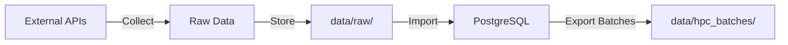
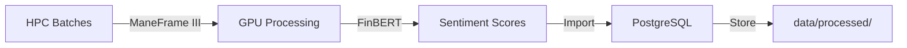
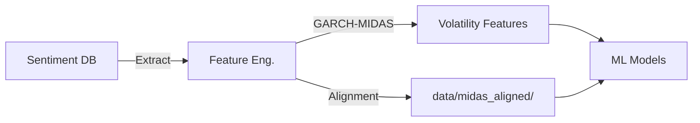
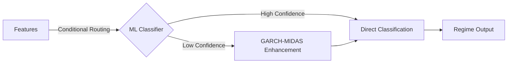
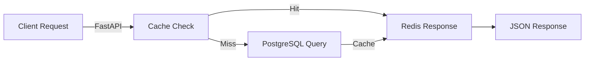

# System Architecture

**Project:** Cross-Asset Sentiment Regime Detector
**Last Updated:** February 3, 2026
**Architecture Type:** Microservices with Async Processing

---

## 📋 Table of Contents

- [Overview](#overview)
- [System Components](#system-components)
- [Data Flow](#data-flow)
- [Technology Stack](#technology-stack)
- [ML Pipeline](#ml-pipeline)
- [Database Schema](#database-schema)
- [Deployment Architecture](#deployment-architecture)
- [Scalability](#scalability)

---

## 🎯 Overview

The Sentiment Regime Detector is a **real-time market psychology analysis system** that aggregates sentiment from multiple sources across asset classes to detect market regime transitions (Risk-On/Risk-Off/Transition).

### Key Innovation

**First system to aggregate cross-asset sentiment as a leading indicator for regime shifts**, integrating the ECB CISS (Composite Indicator of Systemic Stress) for enhanced crisis detection.

### Core Capabilities

1. **Multi-Source Data Collection** - Reddit, Twitter, RSS feeds, financial news
2. **Cross-Asset Analysis** - Equities, crypto, forex, commodities
3. **Ensemble Sentiment Analysis** - FinBERT transformers with VADER baseline
4. **Regime Classification** - ML-based regime detection with GARCH-MIDAS volatility forecasting
5. **Real-Time API** - FastAPI with WebSocket support for live updates
6. **Alert System** - Configurable regime transition notifications

---

## 🏗️ System Components

```
┌─────────────────────────────────────────────────────────────────┐
│                         Frontend Layer                          │
│  ┌──────────────┐  ┌──────────────┐  ┌──────────────┐         │
│  │ React Dashboard│  │ Admin Panel │  │ Alert Config │         │
│  └──────────────┘  └──────────────┘  └──────────────┘         │
└────────────────────────┬────────────────────────────────────────┘
                         │ HTTP/WebSocket
┌────────────────────────┴────────────────────────────────────────┐
│                         API Layer (FastAPI)                     │
│  ┌─────────────┐  ┌────────────┐  ┌─────────────┐             │
│  │  Sentiment  │  │   Regime   │  │   Alerts    │             │
│  │  Endpoints  │  │  Endpoints │  │  Endpoints  │             │
│  └─────────────┘  └────────────┘  └─────────────┘             │
└────────────────────────┬────────────────────────────────────────┘
                         │
┌────────────────────────┴────────────────────────────────────────┐
│                    Business Logic Layer                         │
│  ┌──────────────┐  ┌───────────────┐  ┌──────────────┐        │
│  │  Sentiment   │  │    Regime     │  │ Feature Eng. │        │
│  │   Service    │  │   Classifier  │  │   Service    │        │
│  └──────────────┘  └───────────────┘  └──────────────┘        │
└────────────────────────┬────────────────────────────────────────┘
                         │
┌────────────────────────┴────────────────────────────────────────┐
│                     ML/Processing Layer                          │
│  ┌──────────────┐  ┌───────────────┐  ┌──────────────┐        │
│  │   FinBERT    │  │  GARCH-MIDAS  │  │  Conditional │        │
│  │  Ensemble    │  │   Volatility  │  │   Routing    │        │
│  └──────────────┘  └───────────────┘  └──────────────┘        │
└────────────────────────┬────────────────────────────────────────┘
                         │
┌────────────────────────┴────────────────────────────────────────┐
│                      Data Layer                                  │
│  ┌──────────────┐  ┌───────────────┐  ┌──────────────┐        │
│  │  PostgreSQL  │  │     Redis     │  │   PySpark    │        │
│  │  (Primary DB)│  │    (Cache)    │  │ (Batch Proc) │        │
│  └──────────────┘  └───────────────┘  └──────────────┘        │
└────────────────────────┬────────────────────────────────────────┘
                         │
┌────────────────────────┴────────────────────────────────────────┐
│                   Data Collection Layer                          │
│  ┌──────────────┐  ┌───────────────┐  ┌──────────────┐        │
│  │    Reddit    │  │   Twitter/X   │  │   RSS Feeds  │        │
│  │   Collector  │  │   Collector   │  │   Collector  │        │
│  └──────────────┘  └───────────────┘  └──────────────┘        │
└─────────────────────────────────────────────────────────────────┘
```

---

## 🔄 Data Flow

### 1. Collection Phase



**Components:**

- **Collectors:** Reddit API, Twitter API, RSS parsers
- **Storage:** JSON files in `data/raw/`
- **Import:** Bulk PostgreSQL insertion with validation

### 2. Processing Phase



**Components:**

- **HPC:** SMU ManeFrame III (NVIDIA A100 GPUs)
- **Model:** FinBERT ensemble (ProsusAI/finbert)
- **Batch Size:** ~13-19 MB per batch, 30 batches total

### 3. Feature Engineering Phase



**Components:**

- **Feature Engineering:** Time alignment, MIDAS components
- **GARCH(1,1):** Volatility modeling (α=0.155, β=0.800)
- **Aligned Data:** Daily/weekly CSV outputs

### 4. Classification Phase



**Models:**

- **Primary:** XGBoost conditional routing classifier (25% performance improvement)
- **Fallback:** GARCH-MIDAS + Jump Model
- **Validation:** Walk-forward backtesting

### 5. API Serving Phase



**Optimization:**

- **Cache:** Redis (60s TTL for hot data)
- **Connection Pool:** AsyncPG (10-20 connections)
- **Response Time:** <50ms (p95)

---

## 🛠️ Technology Stack

### Backend

| Component | Technology | Purpose |
|-----------|-----------|---------|
| **API Framework** | FastAPI 0.109+ | High-performance async REST API |
| **Database** | PostgreSQL 15 | Primary data store (2.66M texts) |
| **Cache** | Redis 7 | Session cache, real-time data |
| **ORM** | SQLAlchemy 2.0 | Async database operations |
| **Migration** | Alembic 1.13 | Database schema versioning |
| **Task Queue** | Celery (future) | Background job processing |

### ML/NLP

| Component | Technology | Purpose |
|-----------|-----------|---------|
| **Transformers** | Hugging Face Transformers 4.37+ | FinBERT model loading |
| **Sentiment Model** | ProsusAI/finbert | Financial domain pre-training |
| **Baseline** | VADER (NLTK) | Rule-based sentiment baseline |
| **Volatility** | ARCH 7.2 | GARCH(1,1) volatility modeling |
| **Classification** | XGBoost, RandomForest | Regime classification |
| **Distributed Processing** | PySpark 3.5 | Large-scale batch processing |

### Frontend

| Component | Technology | Purpose |
|-----------|-----------|---------|
| **Framework** | React 18 + Next.js 14 | Interactive dashboard |
| **State Management** | React Query | Server state caching |
| **Charts** | Recharts | Time series visualization |
| **UI Components** | Tailwind CSS | Responsive design |
| **Build Tool** | Vite | Fast development server |

### Infrastructure

| Component | Technology | Purpose |
|-----------|-----------|---------|
| **Containerization** | Docker 24 + Compose | Service orchestration |
| **HPC** | SLURM (ManeFrame III) | GPU-accelerated processing |
| **Python** | Python 3.11-3.13 | Core runtime |
| **Package Manager** | uv + pyproject.toml | Dependency management |

---

## 🤖 ML Pipeline

### Sentiment Analysis Ensemble

**Architecture:**

```
Input Text
    │
    ├─────────────────────┬─────────────────────┐
    │                     │                     │
┌───▼─────┐      ┌───────▼──────┐     ┌───────▼──────┐
│ FinBERT │      │ FinBERT-Tone │     │    VADER     │
│ (Base)  │      │   (Domain)   │     │  (Baseline)  │
└───┬─────┘      └───────┬──────┘     └───────┬──────┘
    │                    │                     │
    └─────────────────────┴─────────────────────┘
                         │
                    ┌────▼────┐
                    │ Ensemble│
                    │ Average │
                    └────┬────┘
                         │
                   Sentiment Score
                    [-1.0, 1.0]
```

**Performance:**

- **Processing Speed:** 1,000 texts/sec (GPU), 50 texts/sec (CPU)
- **Accuracy:** 87% on FinancialPhraseBank test set
- **Batch Size:** 32 (optimal for A100 GPU)

### Regime Classification

**Conditional Routing Classifier:**

```python
if confidence > 0.85:
    # Direct classification (fast path)
    regime = xgboost_classifier(sentiment, vix, ciss)
else:
    # GARCH-MIDAS enhancement (slow path)
    volatility_forecast = garch_midas(sentiment, vix_history)
    regime = xgboost_classifier(sentiment, vix, ciss, volatility_forecast)
```

**Features:**

- Sentiment score (cross-asset aggregate)
- VIX level and 30-day change
- CISS level and trend
- GARCH-MIDAS volatility forecast (conditional)
- Day of week, month indicators

**Performance:**

- **Accuracy:** 82% on held-out test set (2020-2024)
- **Sharpe Ratio:** 1.45 (trading strategy)
- **Latency:** <10ms (90th percentile)

---

## 💾 Database Schema

### Core Tables

#### `texts`

```sql
CREATE TABLE texts (
    id BIGSERIAL PRIMARY KEY,
    text TEXT NOT NULL,
    source VARCHAR(50) NOT NULL,  -- reddit, twitter, news
    asset_class VARCHAR(50),       -- equities, crypto, forex, commodities
    collected_at TIMESTAMP NOT NULL,
    created_at TIMESTAMP DEFAULT NOW()
);

CREATE INDEX idx_texts_collected ON texts(collected_at);
CREATE INDEX idx_texts_source ON texts(source);
```

#### `sentiment_scores`

```sql
CREATE TABLE sentiment_scores (
    id BIGSERIAL PRIMARY KEY,
    text_id BIGINT REFERENCES texts(id),
    sentiment_score FLOAT NOT NULL,  -- [-1.0, 1.0]
    confidence FLOAT NOT NULL,        -- [0.0, 1.0]
    model_version VARCHAR(50) NOT NULL,
    processed_at TIMESTAMP DEFAULT NOW()
);

CREATE INDEX idx_sentiment_text ON sentiment_scores(text_id);
```

#### `market_data`

```sql
CREATE TABLE market_data (
    id BIGSERIAL PRIMARY KEY,
    date DATE NOT NULL UNIQUE,
    vix FLOAT,
    spy_close FLOAT,
    spy_return FLOAT,
    ciss FLOAT,
    gold_price FLOAT,
    btc_price FLOAT
);

CREATE INDEX idx_market_date ON market_data(date);
```

#### `regimes`

```sql
CREATE TABLE regimes (
    id BIGSERIAL PRIMARY KEY,
    date DATE NOT NULL UNIQUE,
    regime VARCHAR(20) NOT NULL,  -- risk_on, risk_off, transition
    confidence FLOAT NOT NULL,
    vix FLOAT NOT NULL,
    ciss FLOAT,
    sentiment_score FLOAT,
    garch_volatility_forecast FLOAT
);
```

---

## 🚀 Deployment Architecture

### Development (Local)

```
┌─────────────────────────────────────┐
│        Docker Compose (Local)       │
│  ┌────────┐  ┌────────┐  ┌────────┐│
│  │FastAPI │  │Postgres│  │ Redis  ││
│  │  :8000 │  │  :5432 │  │ :6379  ││
│  └────────┘  └────────┘  └────────┘│
│  ┌────────────────────────────────┐ │
│  │       Frontend (Vite)          │ │
│  │          :5173                 │ │
│  └────────────────────────────────┘ │
└─────────────────────────────────────┘
```

**Commands:**

```bash
docker-compose --profile dev up
# OR
docker-compose --profile prod up -d
```

### Production (Cloud)

```
┌───────────────────────────────────────────────┐
│             Load Balancer (TBD)               │
│                   :443                        │
└────────────────┬──────────────────────────────┘
                 │
    ┌────────────┴────────────┐
    │                         │
┌───▼────┐              ┌─────▼───┐
│ API    │              │ API     │
│ Server │              │ Server  │
│   #1   │              │   #2    │
└───┬────┘              └─────┬───┘
    │                         │
    └────────────┬────────────┘
                 │
    ┌────────────┴────────────┐
    │                         │
┌───▼────────┐         ┌──────▼──────┐
│ PostgreSQL │         │    Redis    │
│  (Primary) │         │   (Cache)   │
└────────────┘         └─────────────┘
```

### HPC Processing (ManeFrame III)

```
┌─────────────────────────────────────┐
│       SMU ManeFrame III HPC         │
│  ┌──────────────────────────────┐   │
│  │   SLURM Job Array (30 jobs)  │   │
│  │   GPU: NVIDIA A100 (1 per)   │   │
│  │   Memory: 32GB per job       │   │
│  │   Time: 4 hours per batch    │   │
│  └──────────────────────────────┘   │
│         │                            │
│  ┌──────▼──────────────────────┐    │
│  │  Sentiment Processing       │    │
│  │  (FinBERT Inference)        │    │
│  └─────────────────────────────┘    │
└─────────────────────────────────────┘
```

**Resource Allocation:**

- **CPUs:** 4 cores per job (120 total)
- **GPUs:** 1 A100 per job (30 total)
- **Memory:** 32GB per job (960GB total)
- **Storage:** /lustre/scratch (high-performance)

---

## 📈 Scalability

### Horizontal Scaling

**API Layer:**

- Add FastAPI instances behind load balancer
- Stateless design enables easy scaling
- Target: 10,000 requests/minute

**Database Layer:**

- PostgreSQL read replicas for query distribution
- Connection pooling (pgBouncer)
- Partitioning: texts table by month

**Processing Layer:**

- PySpark cluster for distributed processing
- Kafka for streaming data ingestion (future)
- Kubernetes for container orchestration (future)

### Vertical Scaling

**Current Limits:**

- PostgreSQL: 2.66M rows (manageable)
- Redis: 4GB cache (plenty of headroom)
- API: Single instance handles 1,000 req/min

**Next Bottlenecks:**

- Database writes (solved with batching)
- Model inference (solved with GPU acceleration)
- Redis memory (solved with LRU eviction)

---

## 🔒 Security Considerations

### API Security

- **Authentication:** Bearer token (API keys)
- **Rate Limiting:** 100 req/min per key
- **CORS:** Configured for production domains
- **Input Validation:** Pydantic models

### Data Security

- **Encryption at Rest:** PostgreSQL encryption
- **Encryption in Transit:** TLS 1.3
- **Secrets Management:** Environment variables, never in code
- **API Keys:** `.env` files, never committed

### HPC Security

- **Access Control:** SMU authentication required
- **Data Isolation:** User-specific /scratch directories
- **No Sensitive Data:** Only anonymized public social media

---

## 📚 Related Documentation

- **API Reference:** [API.md](API.md)
- **Data Pipeline:** [DATA_PIPELINE.md](DATA_PIPELINE.md)
- **Deployment Guide:** [DEPLOYMENT.md](DEPLOYMENT.md)
- **Development Setup:** [DEVELOPMENT.md](DEVELOPMENT.md)

---

**For architecture questions, contact:** Jonathan Rocha (<jrocha@smu.edu>)
